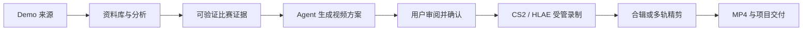

# Vibe CS 产品全景、竞品能力与视觉重设计说明

> 文档类型：产品能力基线 + 竞品分析 + 全产品视觉重设计 Brief  
> 角色视角：产品经理  
> 基线日期：2026-08-15  
> Vibe CS：`3d71c8b` / `0.1.0`  
> CS Demo Manager：`8961f50` / `3.20.1`  
> CS2 Insight Agent：`02920eb` / `2.6.0`

## 1. 一页结论

Vibe CS 不是单纯的 Demo 管理器，也不应被设计成“CS Demo Manager 加一个聊天框”。当前产品已经形成一条完整且差异化的本地视频生产链路：



三个产品各自最强的部分不同：

| 产品 | 最强能力 | 核心心智 | 主要短板 |
| --- | --- | --- | --- |
| Vibe CS | 证据约束的 Agent、受管录制、内置剪辑和可追溯交付 | “把一场 Demo 变成可信且可控的视频” | 功能入口多、视觉语言不够统一、部分页面仍像工程后台 |
| CS Demo Manager | 成熟的比赛数据库、细粒度统计、玩家/队伍工具、多来源下载 | “管理并研究我的所有比赛” | 高密度、图标优先、学习成本高，视频制作仍偏工具链配置 |
| CS2 Insight Agent | 节目化高光标签、OBS 自动录制、创作者友好的合辑与 LiteCut | “快速找节目效果并一键出片” | 依赖较多外部配置，AI 更接近锐评而非端到端创作代理 |

产品重设计应围绕一个清晰定位展开：

> **Vibe CS 是面向 CS2 复盘者与视频创作者的本地 AI 制作工作台。它从真实 Demo 证据出发，让 Agent 完成选材、镜头设计、录制、剪辑到 MP4 交付；用户始终保留审阅和确认权。**

视觉上不建议复刻 CS Demo Manager 的“黑色数据库工具”，也不建议完全复制 CS2 Insight Agent 的“橙色电竞控制台”。推荐建立“竞技转播工作台”方向：以中性深色工作台承载长时间使用，以蓝色表达证据与分析，以暖橙表达创作与执行，以紫色表达 Agent 建议，并通过统一的工作区、数据表、时间轴、雷达和确认面板形成自己的产品识别。

## 2. 产品定位

### 2.1 目标用户

#### A. 高光创作者

- 有职业比赛、平台比赛或个人 Demo。
- 想快速找到某位选手的关键操作并制作成片。
- 不希望学习 HLAE、脚本、编码器和复杂 NLE。
- 关心最终画面、节奏、镜头意图和导出结果。

#### B. 复盘者与战术分析者

- 需要从回合、经济、交战、路线和选手对位中找到依据。
- 需要 2D 回放、热力图、证据定位和跨比赛搜索。
- 不能接受 AI 编造不存在的坐标、结论或镜头依据。

#### C. 重度资料库用户

- 长期积累大量 Demo。
- 需要导入、监听、搜索、标签、备注、状态追踪和批量处理。
- 更重视密度、键盘效率和稳定任务恢复。

#### D. 剪辑师与内容包装者

- 在自动录制结果之上继续做合辑、BGM、字幕、调色和多轨编辑。
- 需要素材管理、代理、重定位、撤销重做、预设和可恢复工程。

### 2.2 核心用户任务

1. 找到一场或一组选定比赛。
2. 让系统生成可信的比赛结构和高光证据。
3. 让 Agent 根据地图、移动路线和交战轴设计视频。
4. 在实际录制前理解每个片段、视角和镜头的目的。
5. 修改选择后显式确认。
6. 自动完成 CS2 回放、HLAE 采集和 MP4 编码。
7. 在合辑或多轨编辑器中继续打磨。
8. 找到、重命名、分享或清理最终输出。

### 2.3 产品原则

- **结果优先**：用户购买的是视频和复盘结论，不是 HLAE、FFmpeg、进程或配置文件。
- **证据优先**：坐标、路线、对位、标签和 AI 结论必须能回到 Demo 证据。
- **确认优先**：Agent 可以提出完整方案，但不能绕过用户确认直接录制或修改工程。
- **本地优先**：Demo、媒体、模型密钥和项目状态尽可能留在本机。
- **渐进披露**：默认展示用户要做的决定；实现细节只进入诊断或高级设置。
- **任务连续**：从分析到成片应是一条可追踪的任务，而不是多个互不相识的工具页。

## 3. Vibe CS 当前完整功能

本节只描述当前代码中已经存在并接入桌面端、服务、运行时或持久化层的能力。实验原型会单独标注。

### 3.1 桌面壳与全局工作区

- Tauri 桌面应用，WebView2 内呈现 React 工作区。
- 自绘窗口标题栏、折叠侧栏、移动尺寸导航、暗色/亮色主题。
- 主导航按“复盘”“制作”分组，另有首页、Activity 和设置。
- `Ctrl+K` 快速跳转核心页面。
- 标题栏持续显示本地服务状态和当前游戏回放状态。
- 游戏回放运行时可从全局标题栏停止。
- Agent 以工作区 Dock 形式常驻，可读取当前选中的 Demo、工程和音乐上下文。
- 中文与英文资源切换；语言和主题保存成功后才正式生效。

### 3.2 首页与使用引导

- 提供产品工作流入口和新用户引导。
- 指向比赛资料库、分析、制作、剪辑、输出、数据路径等主要区域。
- 提供环境或依赖未就绪时的对应入口。
- 当前更接近导航页，尚不是聚合最近工作、失败任务和待确认方案的动态首页。

### 3.3 Demo 资料库

- 通过桌面文件选择器或浏览器上传导入单个 `.dem`。
- 导入有界 ZIP 包，并防止路径穿越和超限内容。
- 校验 Source 2 文件头、常规文件类型、大小和 SHA-256。
- 同一份 Demo 字节不会重复存储。
- 添加持续监听目录，自动发现新 Demo。
- 监听目录支持防抖、周期性校准、临时离线恢复和显式重扫。
- 拒绝符号链接根目录，避免越过用户选择的文件范围。
- 资料库支持服务端搜索、地图筛选、生命周期筛选、稳定排序和分页。
- 支持最多 12 个明确 Demo 的批量分析选择。
- 支持重命名、备注、标签、删除记录、打开文件位置和启动回放。
- 缺失文件有明确状态；文件重新出现后可恢复。
- Demo 内容变化会使旧分析及其投影失效，不会继续展示过期结论。
- 允许导出筛选后的 Demo 元数据。

### 3.4 Steam 比赛历史与下载

- 配置 Steam ID、Web API Key 和比赛认证信息。
- 同步最近比赛，保存分页比赛记录和下载任务。
- 搜索、分页并导出当前查询结果。
- 下载任务有持久状态、进度、取消和启动恢复。
- 下载后执行有界解压、Demo 校验，并进入统一导入流程。
- 下载完成的比赛可直接进入对应分析。
- 当前仅覆盖 Steam 官方链路；没有 CSDM 的 FACEIT、Renown、5EPlay 多平台入口。

### 3.5 分析任务生命周期

- 为每次分析创建独立、持久的 Analysis Run。
- 状态覆盖排队、运行、完成、失败、中断和取消。
- 阶段覆盖输入校验、解析器排队、解析、源文件复核、投影和完成。
- 每次运行保留有界、按序事件和明确错误。
- 可取消确切的运行，不会误取消另一场或旧任务。
- 应用重启后，失去运行时所有者的任务会被安全终结为中断状态。
- 符合条件的失败、中断或取消任务可以创建新的重试运行；旧历史保留。
- Activity 与 Analysis 页面可定位到确切 run，而不是只显示 Demo 的模糊状态。
- 分析工作区一次可容纳最多 12 场 Demo，并行处理上限为两场。

### 3.6 比赛概览与基础数据

- 解析队伍、阵容、玩家数据、比分、回合和时间线。
- 展示击杀、死亡、助攻、爆头、ADR、K/D 等记分板信息。
- 展示购买、伤害、目标事件和投掷物事件。
- 按回合查看比分推进、回合结果、队伍阵容与关键事件。
- 可从高光、回合或具体事件加入录制队列。
- 缺少数据的指标明确显示不可用，不用推算值填空。

### 3.7 高光与证据标签

- 检测多杀、单发爆头、穿墙、盲狙、刀杀、电击枪和拆包等时刻。
- 检测有阵容依据的残局胜利和残局失败。
- 检测赛点、决胜回合、经济翻盘、低血量、远距离和移动击杀。
- 检测自伤、队伤和重复对手等跨回合证据集合。
- 高光保留稳定 ID、玩家、回合和 tick 区间，可被 Agent 和录制方案引用。
- 不把多个不连续事件伪装成一个连续片段。

### 3.8 高级复盘工作区

- Opening Duel：首杀统计、方向对位和相关证据。
- Duel：玩家对位与交战证据。
- Clutch Review：残局条件、结果与参与者证据。
- Team Round：基于逐回合阵容真值的队伍回合视图。
- Team Economy：购买、装备和经济证据。
- Man Advantage：按死亡事件变化的人数优势复盘。
- Objective Review：下包、拆包、爆炸与回合结局的目标事件复盘。
- Utility：投掷物生命周期、伤害、闪光和事件证据；不完整生命周期会明确降级。
- Player Atomic Evidence：玩家相关的击杀、死亡、伤害等细粒度证据。

### 3.9 2D 回放、雷达与热力图

- 从 Demo 中采样玩家实体位置和朝向。
- 保留手雷、火、烟和 C4 生命周期证据。
- 使用 ARPL 二进制传输高密度回放数据。
- 支持回合级回放、播放进度、事件定位和玩家选择。
- 从本地 overview 或 VPK v2 读取地图雷达及坐标变换。
- 解码支持的 Source 2 雷达纹理为浏览器可用 PNG。
- 支持选手、队伍、事件和楼层维度的热力图。
- 支持跨比赛玩家地图热图。
- 坐标不足时显示明确的“空间证据不可用”，不会生成虚假路线。

### 3.10 玩家、阵容与跨比赛证据

- 从持久分析构建全局玩家目录。
- 保存玩家别名、聚合数据和最近比赛。
- 支持搜索、排序、分页和精确的最多两名玩家比较。
- 支持跨比赛地图表现和热力图。
- 配置 Steam Web API Key 后，可获取玩家公开摘要和头像。
- 头像经过 MIME 校验后进入有界本地缓存。
- 提供已验证阵容/Lineups 视图。
- 当前没有 CS Demo Manager 那种完整的持久 Team 实体、队伍历史和队伍表现页。

### 3.11 Evidence Search、评论和标签

- 跨比赛搜索击杀、死亡、回合、目标事件和其他规范化证据。
- 搜索结果可回到确切 Demo、回合、tick、玩家和证据位置。
- Evidence Annotation 支持正文、标签和 open/resolved 状态。
- 提供全局注释索引以及从分析页面创建、查看和更新注释的入口。
- Demo、Player、Round 共享一套 Review Tag catalog 和评论能力。
- 当前尚未覆盖比赛聊天读取/导出、跨 subject 批量标签和团队权限。

### 3.12 AI Review

- 用户显式发起后，基于有界比赛证据生成点评。
- 用户选择点评范围和语气，而不是把任意原始 Prompt 直接交给后端。
- 返回的证据引用必须属于发送给模型的证据集合。
- 支持保存和导出独立 HTML Review。
- AI Review 是可选能力；没有模型配置时不影响本地分析。

### 3.13 端到端 Agent 视频生成

- Agent 运行在 Rust 桌面宿主进程内，没有独立 Node Agent 服务。
- 用户可把 Demo、编辑工程和 BGM 作为明确上下文加入会话。
- Agent 可读取有界工作区、Demo、回合、玩家、对位、高光、编辑时间线和音乐分析。
- Agent 可搜索回合、读取回合上下文、读取具体事件和玩家对位。
- Agent 可读取被选高光的 cinematic context，包括地图、雷达相对路线、位置样本、移动轴和经击杀事件验证的交战轴。
- Agent 只能提出 typed proposal，不能访问通用文件系统、Shell、SQL、任意网络请求或任意 HLAE 命令。
- `video_render` 方案绑定具体 Demo、高光、玩家、tick、镜头意图、镜头类型和 MP4 目标。
- 视频方案会展开真实录制工作区，用户可增删片段、调整视角和前后留白。
- 预览重新校验 Demo、分析、高光、玩家、tick、录制环境和方案指纹。
- 用户最终确认后才创建持久录制任务。
- Agent 跟踪启动、跳转、采集、稳定、编码和输出发布阶段。
- 只有宿主报告任务完成且出现 MP4，Agent 才能宣称生成完成。
- 编辑方案和节拍对齐方案同样需要预览、修订和确认，不能直接覆盖工程。

### 3.14 地图感知镜头

- 镜头类型：POV、Orbit、Dolly、Static、Tracking、Crane、Flyby。
- 镜头意图：选手 POV、建立地点、跟随突破、揭示对决、保持交叉火力、高潮后升起、穿越空间转场。
- 每个镜头需要具体理由，不以“增加变化”为唯一理由。
- 建立镜头和运动镜头会参考地图相对坐标、实际移动路线、行动跨度和交战方向。
- 最近敌人只作为距离上下文；经击杀事件验证的交战轴才可作为强依据。
- 没有空间证据时回退到 POV，不猜测运镜路径。
- 当前没有碰撞几何和完整三维地图网格，因此仍需避免声称绝对不会穿墙。

### 3.15 受管录制

- 从队列生成确定性录制计划。
- 校验 Demo、tick 范围、tick rate、前后留白、速度、选手身份和输出名。
- 任意队列编辑都会使旧预览计划失效。
- Director Preview 会合并相邻镜头，并只在有明确受害者身份时提供受害者视角。
- 录制前校验 CS2、受管 HLAE、Demo 内容、观察者证据、Media Foundation H.264/AAC 和输出目录。
- CS2 以离线 `-insecure` 模式启动。
- HLAE 是 Agent 的内部采集工具，不作为用户最终产物。
- 鉴权本地 bridge 持续确认 Demo、tick 和 POV 身份。
- 支持 FOV、持枪 FOV、闪光强度、HUD、雷达和语音策略。
- 支持取消、失败清理、孤儿任务恢复和安全重试。
- 使用 Windows Media Foundation 原生写出 H.264/AAC MP4。
- 输出原子发布，并记录时长、请求和 tick 元数据。
- 不要求用户配置 OBS、FFmpeg 可执行文件、编码器命令或 HLAE 脚本。

### 3.16 合辑工作台

- 浏览和筛选已录制片段。
- 拖拽排序、裁切片段、保留原声。
- 配置 BGM、转场、片头、名牌和片尾。
- 支持主题、头像名牌和包装素材。
- 选择分辨率、帧率和编码策略。
- 持久导出任务、机器进度、取消和失败后的安全回退编码。
- 音乐分析提供 BPM、置信度、节拍网格、onset、能量曲线和启发式段落。
- 节拍对齐只生成可解释建议，不直接修改项目。

### 3.17 多轨编辑器

- 新建、打开、复制和模板化编辑工程。
- 视频、音频、图片、文字和叠加轨。
- 素材导入、验证、代理生成、失败重试和安全清理。
- 源裁切、时间线位置、画面变换、透明度、音量、调色和淡化。
- 支持受限关键帧和分段变速。
- 支持拆分、裁切、波纹操作、滑移、多选、编组和音视频链接。
- 支持吸附、标记、撤销、重做和项目尾部时长。
- 从视频中原子分离音频并保持时间对齐。
- 支持麦克风旁白和自定义字体。
- 保存可复用预设，并以一次原子变更应用。
- 乐观版本保存、快照历史、冲突恢复和防陈旧自动保存。
- 丢失素材可通过桌面路径或浏览器上传重定位。
- 导入/导出便携工程包；每个资产有 SHA-256、数量/大小/路径限制和新 ID。
- 按工程范围导出最终视频。

### 3.18 输出、Activity 和恢复

- 统一浏览录制结果和导出结果。
- 按可用性和任务状态筛选。
- 管理受管文件的重命名、定位、删除、批量删除和无效记录清理。
- 外部文件只移除记录，不越权删除。
- 删除受管文件使用可回滚暂存流程。
- Activity Center 聚合分析、下载、录制和导出任务。
- 精确展示任务状态、阶段、错误、时间和可用操作。
- 支持安全的取消、重试和跳转到来源或结果。
- Recovery Center 展示配置备份和恢复状态。
- 支持导出不含密钥和媒体内容的诊断 JSON。
- 本地日志按天写入并保留有限数量。

### 3.19 饰品与 Demo 改写

- 检查 Demo 中真实存在的受限饰品字段。
- 从本地 CS2 item schema 和 VPK 构建本地化物品/涂装目录。
- 支持真实 PNG 预览。
- 创建、载入和删除每个 Demo 的饰品方案。
- 校验后写出新的 Demo 文件并作为新资料库记录导入。
- 原 Demo 永不原地修改。
- 改写范围保持在四个白名单字段内，不接受任意实体修改。

### 3.20 设置与诊断

- 通用：语言、主题、数据和应用行为。
- 路径：CS2、Steam、Demo、录制、导出和应用数据目录。
- Steam：身份、API Key、认证代码和同步状态。
- 视频：MP4 输出能力与受管录制环境。
- 分析：解析缓存、AI provider、模型、endpoint 和密钥。
- 录制：前后留白、画面、HUD、雷达、语音和 FOV 默认值。
- HLAE 由用户显式准备，固定官方来源并验证归档和文件完整性。
- 模型密钥加密保存；UI 只返回“是否已配置”。
- 支持 OpenAI-compatible 和本地 loopback provider。
- 支持手动检查公共 HTTPS 更新清单，不自动下载或执行更新。

### 3.21 当前明确不做或仍缺失的能力

- 不提供云账户、多人协作或公开网络 API。
- 不提供任意 Shell、脚本、进程、SQL 或文件系统 Agent 工具。
- 不提供原始比赛聊天读取和导出。
- 不提供完整的持久 Team 页面、队伍历史、队伍热图和队伍表现。
- 不提供 FACEIT、Renown、5EPlay 等多平台下载。
- 不提供 CSDM 的全局 Ban 统计。
- 不提供完整三维碰撞地图，电影镜头仍有穿墙风险。
- 不把空间证据不足的 Demo 伪装成可地图感知运镜。

## 4. CS Demo Manager 功能全景

### 4.1 Demo 与比赛数据库

- Demos、Analyses、Matches 三个独立生命周期入口。
- 多目录管理、子目录选项和归档解压设置。
- 高密度数据表、列显隐、筛选、模糊搜索和多选。
- Demo/Match 重命名、标签、评论、类型修正、Reveal 和 Watch。
- 解析任务状态、日志、清理和跳转。
- JSON、XLSX、聊天记录和多种分析导出。

### 4.2 单场比赛分析

- 比赛 Overview 和完整 scoreboard。
- 比分、阵容、回合时间线和比赛元信息。
- Rounds 总览与逐回合详情。
- 玩家回合信息、经济、击杀流、残局和回合评论/标签。
- 单场 Players：击杀、武器、道具和残局面板。
- Weapons：使用和命中表现。
- Duels：玩家对位矩阵。
- Opening Duels：统计和地图视图。
- Grenades：使用统计、闪光矩阵和投掷物查找器。
- Economy：装备价值、经济类型、优势与回合结果。
- Heatmap：比赛级位置/事件热图。
- 2D Viewer：雷达、玩家、枪声/击杀、道具、C4、音频、速度、回合和全屏。
- Chat：读取并导出比赛聊天。

### 4.3 玩家与队伍分析

- 全局 Players 列表和筛选。
- Player Overview、最近比赛、胜率、残局、多杀、目标、首杀和道具表现。
- K/D、ADR、爆头率、比赛数量、段位分布等趋势图。
- 玩家地图表现、热力图、段位历史和比赛历史。
- 玩家 XLSX 导出。
- Teams 实体、队伍 Overview、比赛、地图、热力图和表现。
- 队伍按阵营、经济和目标的多种图表。

### 4.4 搜索、封禁和下载

- 跨比赛搜索击杀、多杀、残局、忍者拆包、地图和玩家。
- 玩家 VAC/Game/Community Ban 标记。
- 全局 Ban 按日期、竞技段位、Premier 段位统计和最近封禁列表。
- Valve 比赛历史和分享码下载。
- FACEIT、Renown、5EPlay 账户与比赛下载。
- Pending Downloads、批量下载、进度和下载后跳转。

### 4.5 视频制作

- 从 scoreboard、击杀、死亡、回合或自定义事件生成视频 sequences。
- 每个 sequence 可编辑起止 tick、玩家、视角、语音和事件强调。
- 比赛 timeline 可放置击杀、回合、C4 和相机标记。
- 自定义 camera 和 player camera 管理。
- 支持 HLAE、FFmpeg、VirtualDub 安装/更新/路径配置。
- 支持分辨率、帧率、编码器、容器、CRF、音频、X-ray、死亡通知和语音。
- 视频队列支持暂停、恢复、移除完成项和全部清理。

### 4.6 设置和运维

- UI、初始页面、语言、主题、硬件加速、日期和表格状态。
- Demo 文件夹、Tags、Maps、Downloads、Playback、Analyze、Video、Cameras、Ban、Integrations、Database、About 等多类设置。
- 自定义地图雷达、比例、楼层阈值和缩略图。
- 自定义 camera 坐标、角度和预览图。
- 分析并发数、位置解析、封禁忽略规则。
- 数据库导入、优化、重置和尺寸展示。

### 4.7 值得借鉴的部分

- 比赛数据库、玩家和队伍分析的覆盖深度。
- 高密度表格、列配置、上下文菜单和批量动作。
- 单场比赛内稳定的二级导航。
- 搜索、下载、任务队列和数据维护都作为一等产品对象。
- CT/T、玩家颜色、经济和段位颜色具有明确领域语义。

### 4.8 不应照搬的部分

- 60px 纯图标侧栏对新用户不友好。
- 超宽表格和大量并列入口让新用户难以建立主流程。
- HLAE、FFmpeg、VirtualDub 和编码参数直接进入普通用户路径。
- 视频制作更像专业工具配置，不是围绕最终故事和镜头意图组织。
- 默认视觉过于接近数据库客户端，弱化了“复盘 → 创作 → 成片”的产品叙事。

## 5. CS2 Insight Agent 功能全景

### 5.1 Demo 资料库

- 以卡片形式展示平台、比分、地图、关注玩家、显示名和备注。
- 监听 5E、完美、官匹、FACEIT 等下载目录并自动入库。
- 支持多选 Demo 进入分析，也可在分析页直接上传。

### 5.2 创作者导向的 Demo 分析

- 自动解析全场玩家并按玩家浏览。
- 高光：多杀、颗秒、残局、刀杀、跳杀、拆包等。
- 下饭：电击枪、沙鹰、队伤、人体描边、肩并肩等节目化标签。
- 跨回合合集：重复击杀/死亡、全部击杀、全部死亡、回合合集。
- 梗局：211、o、i、z 等局级标签。
- 回合时间线和单次击杀/死亡入队。
- 2D 回放、热力图、概览、玩家、回合和经济。
- 饰品查看、3D/游戏内检视和闭源自定义换肤方案。

### 5.3 OBS 自动录制

- 多场、多片段录制队列。
- 启动 CS2 回放并通过 OBS 成片。
- 观战 HUD、视野、持枪角度、闪光、语音、分辨率和画幅设置。
- 裁判视角或实验性 POV 第一人称 HUD。
- 受害者视角自动追加。
- WASD/蹲跳按键叠加。
- 颗秒、复仇、穿墙、盲狙、多杀等带声音和透明通道的 KillFX。
- 片段间 OBS 转场。
- 录制前备份，录制后恢复游戏设置。

### 5.4 合辑与 LiteCut

- 录制片段自动入库，拖拽排序、BGM、主题、片头和片尾。
- 每段可展示玩家头像、昵称、类型、回合和情景标签名牌。
- LiteCut 支持工程、模板、JSON、崩溃恢复和画布设置。
- 视频、音频、图片、字体、代理、重定位和麦克风配音。
- 多轨、裁切、分割、波纹删除、滑移、编组、链接/分离、标记和吸附。
- 调色、滤镜、固定/分段变速、关键帧和多种转场。
- 击杀轴随裁切、移动和变速同步。
- FFmpeg 硬件优先导出。

### 5.5 AI 锐评

- 兼容 DeepSeek、Qwen、GLM、MiniMax、OpenAI、OpenRouter、Ollama 和 LM Studio。
- 以短、毒舌、节目化的 Prompt 生成人物或片段点评。
- 对局级梗标签可触发整局总评。
- AI 不承担当前 Vibe CS 那种端到端视频方案和确定性执行职责。

### 5.6 值得借鉴的部分

- 用用户语言描述结果，不要求用户理解录制管线。
- 高光、下饭、合集、梗局的内容分类非常接近创作者心智。
- 卡片式资料库让少量比赛更易浏览。
- 受害者 POV、信息卡、按键叠加和 KillFX 都是明确的内容包装能力。
- 合辑与 LiteCut 形成由浅入深的两级编辑路径。

### 5.7 不应直接照搬的部分

- OBS、WebSocket、FFmpeg 路径和大量录制设置会显著提高首次成功成本。
- 节目化标签具有强烈内容风格，不应成为所有用户默认的分析语言。
- 卡片库适合小规模浏览，不适合 CSDM 式的大库筛选和批量操作。
- Orange + glow + 多层卡片如果无节制使用，会让复杂工作区显得嘈杂。
- Ant Design、Tailwind 和自定义 CSS 同时存在，长期容易产生组件状态与间距不一致。

## 6. 三产品能力矩阵

说明：`完整` 表示有明确产品入口和对应实现；`部分` 表示覆盖了相邻能力但范围较小；`独有` 表示明显差异化能力；`无` 表示当前未发现对应产品面。

| 能力 | Vibe CS | CS Demo Manager | CS2 Insight Agent | 产品判断 |
| --- | --- | --- | --- | --- |
| 本地 Demo 导入 | 完整 | 完整 | 完整 | 基础能力 |
| ZIP/归档安全导入 | 完整 | 完整 | 部分 | 保留 Vibe 的安全边界 |
| 自动监听目录 | 完整 | 完整 | 完整 | 统一为资料库来源设置 |
| 大库表格/列配置 | 完整但仍可增强 | 完整 | 部分 | 借鉴 CSDM 的效率 |
| 卡片式 Demo 浏览 | 无主视图 | 无主视图 | 完整 | 可作为可选视图，不替代表格 |
| Demo 评论/标签 | 完整 | 完整 | 完整 | 统一到同一 Metadata 模型 |
| 多平台比赛下载 | Steam | Valve/FACEIT/Renown/5E | 目录监听为主 | 中长期补平台连接器 |
| 分析任务日志 | 完整 | 完整 | 部分 | Vibe 的 Activity 更适合统一任务 |
| 比赛概览/记分板 | 完整 | 完整 | 完整 | 需要统一视觉模板 |
| 回合详情 | 完整 | 完整 | 完整 | 核心复盘路径 |
| 玩家单场分析 | 完整 | 完整 | 完整 | 保留 evidence deep link |
| 武器统计 | 部分 | 完整 | 部分 | 借鉴 CSDM 指标深度 |
| Duel / Opening | 完整 | 完整 | 部分 | Vibe 已具备证据优势 |
| Grenade / Utility | 完整但保守 | 完整 | 部分 | 补投掷物查找和路线分析 |
| Economy | 完整 | 完整 | 完整 | 统一比赛分析页结构 |
| 2D Viewer | 完整核心链路 | 完整且交互更丰富 | 完整 | 吸收 CSDM 的音频/绘图/全屏体验 |
| 热力图 | 完整 | 完整 | 完整 | 建立共用地图画布组件 |
| 全局玩家目录 | 完整 | 完整 | 无独立全局产品 | 继续强化 Vibe |
| 玩家趋势/段位 | 部分 | 完整 | 无 | 借鉴 CSDM |
| Team 实体与趋势 | Lineups | 完整 | 仅单场阵容 | Vibe 明显缺口 |
| Ban 统计 | 无 | 完整 | 无 | 仅面向大众匹配用户时建设 |
| 比赛聊天 | 无 | 完整 | 无 | 低于核心视频链路优先级 |
| 跨比赛证据搜索 | 独有且完整 | 事件搜索 | 无 | Vibe 核心差异 |
| Evidence Annotation | 独有 | 无 | 无 | Vibe 核心差异 |
| AI 比赛点评 | 完整且有证据约束 | 无 | 完整且节目化 | 提供专业/娱乐两套语气包 |
| 端到端视频 Agent | 独有 | 无 | 无 | 第一优先级产品心智 |
| 地图感知镜头 | 独有 | 手工 camera | 无 | 继续强化预览和碰撞校验 |
| POV/受害者 POV | 完整 | 完整 | 完整 | 统一成“视角策略” |
| 批量录制队列 | 完整 | 完整 | 完整 | Vibe 增加暂停/恢复体验 |
| HLAE | 内部受管 | 用户配置 | 无主链路 | 不向普通用户暴露 |
| OBS | 无 | 无主链路 | 完整 | 不回引 Vibe 核心架构 |
| KillFX/按键叠加 | 无 | 无 | 完整 | 适合作为可选包装插件 |
| 原生 MP4 | 完整 | FFmpeg/VirtualDub | FFmpeg | Vibe 应强调“无需管工具” |
| 轻量合辑 | 完整 | 无 | 完整 | 保留快速出片路径 |
| 多轨编辑器 | 完整 | 无 | 完整 | Vibe 与 Insight 都具备 |
| BGM 节拍分析 | 完整 | 无 | 部分 | 强化 Agent 卡点能力 |
| 工程包/素材重定位 | 完整 | 无 | 部分 | 专业可靠性差异 |
| 输出资料库 | 完整 | 视频队列为主 | 成片列表 | Vibe 更完整 |
| 统一 Activity | 完整 | 分散任务页 | 分散任务页 | Vibe 更完整 |
| Recovery/诊断 | 完整 | 数据库与日志工具 | 配置备份/恢复 | Vibe 更完整 |
| 自定义地图数据 | 读取本地地图 | 完整设置 UI | 内置资源 | Vibe 可补高级入口 |
| 自定义固定相机 | Agent 自动生成 | 完整手工管理 | 无 | 高级模式可借鉴 CSDM |

## 7. 当前信息架构评估

### 7.1 当前导航

```text
首页
复盘
├─ 比赛资料库
├─ 玩家
├─ 阵容
├─ 证据搜索
└─ 比赛历史
制作
├─ 制作中心
├─ 录制队列
├─ Studio
├─ 合辑
├─ 多轨编辑器
└─ 输出
系统
├─ Activity
├─ 设置
└─ Recovery（上下文入口）
右侧：Agent Dock
```

### 7.2 当前问题

1. “制作中心、Studio、合辑、编辑器、录制队列”边界对新用户不够清楚。
2. Agent 是核心差异，但当前以右侧 Dock 存在，视觉优先级与普通辅助聊天相似。
3. 首页强调入口，缺少待确认方案、运行任务、最近 Demo 和最近输出。
4. Analysis 内子能力很多，但缺少一条稳定的“比赛上下文栏”统一地图、比分、回合、选手和证据定位。
5. Activity、Outputs 和 Recovery 各自正确，却被理解为系统工具，不像一次创作任务的连续状态。
6. 侧栏数值编号、英文 eyebrow 和大量内部术语削弱了中文产品的一致性。

### 7.3 推荐目标信息架构

```text
工作台
├─ 今日工作：待确认、进行中、失败、最近输出
└─ 用 Agent 制作视频

资料库
├─ Demo
├─ 比赛历史
├─ 玩家
├─ 队伍（未来）
└─ 证据搜索

比赛工作区（进入具体 Demo 后）
├─ 概览
├─ 回合
├─ 玩家
├─ 对位
├─ 道具与经济
├─ 回放与热力图
├─ 高光
└─ Review

制作工作区
├─ Agent 方案
├─ 录制计划
├─ 快速合辑
└─ 多轨编辑

交付
├─ 输出
└─ 任务记录

设置
├─ 应用
├─ 文件与资料库
├─ 游戏与录制
├─ AI
└─ 高级与诊断
```

关键变化：Agent 不再只是常驻聊天侧栏，而成为“开始创作”和“修改方案”的主入口；HLAE、编码器和进程信息只出现在高级诊断；Activity 与 Outputs 在任务详情中互相连接。

## 8. 当前 Vibe CS 视觉设计系统

### 8.1 基础风格

- Light-first：浅灰蓝页面 `#f5f7fb`，白色面板，深蓝灰文字。
- 品牌主色：cobalt `#1746d2`；暗色主题使用较亮蓝紫 `#7aa2ff`。
- 字体：Inter / Noto Sans SC / Microsoft YaHei UI；数据和时间码使用 JetBrains Mono / Consolas。
- 圆角：6 / 10 / 14px。
- 阴影：从轻微 1px 到大浮层阴影。
- 侧栏宽 232px，标题栏高 48px。
- 页面大量使用卡片、边框、三栏工作区、Inspector、Drawer 和数据表。

### 8.2 核心组件语言

- 文字侧栏 + 分组导航。
- 自绘标题栏 + breadcrumb + 快速跳转 + 服务状态。
- Power table + 选中详情 Inspector。
- 卡片式指标与证据块。
- Radar/heatmap/replay 专用画布。
- Agent Dock + tool call + proposal + confirmation。
- Recording plan、timeline、media bin、program monitor、property panel。
- Notice、Badge、Empty State、Progress、Dialog、Drawer。

### 8.3 当前优势

- 相比 CSDM 更容易看懂入口和页面层级。
- 同时支持最大化工作站和较窄窗口。
- 状态、错误、不可用和确认被当作正式界面，而非 Toast 后消失。
- 分析、录制、编辑和输出已经共享相近的工作台结构。
- 暗色/亮色、焦点状态、响应式和 reduced motion 有基础支持。

### 8.4 当前视觉问题

1. **品牌性弱**：浅灰蓝 + 白卡容易接近通用企业 SaaS，与 CS2、地图证据和视频创作联系不强。
2. **样式债务明显**：大量页面样式集中在单个 CSS 文件，页面级规则、组件规则和 token 顺序混杂。
3. **字号体系有双层冲突**：旧页面规则中仍残留 6–9px 声明，文件末尾又通过“可读密度修正层”将多数运行时文字抬升到 12–15px。当前界面通常能读，但依赖覆盖顺序，新增页面很容易退回微型字号。
4. **边框过多**：卡片套卡片、表面套表面，信息层级更多依靠盒子而不是排版、留白和内容结构。
5. **圆角不一致**：首页大卡片偏柔和，Editor 又接近专业硬边工作台，像两个产品。
6. **内部语言残留**：英文 eyebrow、数字编号、pipeline/status 等工程语言削弱用户任务。
7. **Agent 不够像主角**：Dock 在视觉上更像辅助聊天，无法表达“它能完成整个视频”的产品定位。
8. **领域色缺少统一规则**：分析蓝、成功绿、警告黄、Agent 紫、时间轴轨道色之间尚未形成跨页面语义表。

### 8.5 当前 Token 全量档案

以下内容记录的是当前实现，而非重设计建议。视觉重构应先把这些值迁移到独立 token 层，再讨论换肤。

#### 8.5.1 浅色主题

| 类别 | Token | 当前值 | 当前用途 |
| --- | --- | --- | --- |
| 画布 | `page` | `#F5F7FB` | 应用主背景 |
| 画布 | `page-alt` | `#EEF2F7` | 次级背景、渐变底 |
| 导航 | `sidebar` | `#FFFFFF` | 左侧导航 |
| 表面 | `surface-1` | `#FFFFFF` | 卡片、主面板 |
| 表面 | `surface-2` | `#F7F9FC` | 输入区、次级面板 |
| 表面 | `surface-3` | `#EEF2F7` | 选中前景、弱区块 |
| 表面 | `surface-4` | `#E3E8F0` | 更强分层 |
| 交互 | `surface-hover` | `#F0F4FF` | Hover |
| 边框 | `border` | `#DFE4EC` | 默认分隔线 |
| 边框 | `border-strong` | `#BDC6D4` | 强分隔、输入焦点前边界 |
| 文字 | `text` | `#172033` | 标题、主内容 |
| 文字 | `text-soft` | `#344054` | 正文、次级标题 |
| 文字 | `muted` | `#667085` | 辅助说明 |
| 文字 | `faint` | `#98A2B3` | 时间、占位、低优先元数据 |
| 品牌 | `accent` | `#1746D2` | 主按钮、选中态、焦点 |
| 品牌 | `accent-strong` | `#1238AA` | 主按钮 Hover |
| 信息 | `blue` | `#246BFD` | 链接、信息、分析 |
| 警告 | `amber` | `#B54708` | 风险、等待 |
| 成功 | `green` | `#067647` | 完成、在线、通过 |
| 危险 | `red` | `#B42318` | 错误、删除、阻塞 |
| Agent | `violet` | `#6941C6` | Agent 或提案相关强调 |

#### 8.5.2 深色主题

| 类别 | Token | 当前值 | 当前用途 |
| --- | --- | --- | --- |
| 画布 | `page` / `page-alt` | `#0E1422` / `#121A2A` | 应用背景 |
| 导航 | `sidebar` | `#101827` | 左侧导航 |
| 表面 | `surface-1` | `#151E2F` | 主面板 |
| 表面 | `surface-2` | `#192337` | 次级面板 |
| 表面 | `surface-3` | `#202C42` | 选中与嵌套区域 |
| 表面 | `surface-4` | `#2B3850` | 强层级 |
| 交互 | `surface-hover` | `#1D2A43` | Hover |
| 边框 | `border` / `border-strong` | `#2A3850` / `#41516C` | 分隔与焦点 |
| 文字 | `text` | `#F5F7FB` | 主文字 |
| 文字 | `text-soft` | `#D0D5DD` | 正文 |
| 文字 | `muted` / `faint` | `#98A2B3` / `#667085` | 辅助与弱化文字 |
| 品牌 | `accent` / `accent-strong` | `#7AA2FF` / `#9BB8FF` | 主动作、选中、焦点 |
| 状态 | `blue` / `amber` / `green` / `red` | `#84ADFF` / `#FDB022` / `#47CD89` / `#F97066` | 信息、警告、成功、失败 |

#### 8.5.3 形状、阴影与尺寸

| 系统 | 当前值 | 说明 |
| --- | --- | --- |
| 圆角 | 6 / 10 / 14px | 控件 / 面板 / 大浮层三级 |
| `shadow-sm` | `0 1px 2px rgba(16,24,40,.05)` | 轻微脱离背景 |
| `shadow-md` | `0 12px 28px rgba(16,24,40,.08)` | 菜单、面板 |
| `shadow-lg` | `0 24px 64px rgba(16,24,40,.14)` | Dialog、Drawer、大浮层 |
| 默认侧栏 | 源码前段 232px，当前修正层 200px | 存在历史值与覆盖值 |
| Agent Dock | 当前修正层 340px | 1100–1279px 时收窄为 300px |
| 标题栏 | 源码前段 48px，当前修正层 42px | 桌面自绘窗口栏 |
| 内容最大宽度 | 1540px | 常规业务页面；编辑器例外 |

### 8.6 字体与信息密度

当前字体栈分成两类：

- 界面字体：Inter、Noto Sans SC、Microsoft YaHei UI、系统无衬线。
- 数据字体：JetBrains Mono、SFMono、Consolas，用于 tick、时间码、ID、命令和技术状态。

当前样式文件末尾存在一层明确的 **Readable-density contract**，其实际意图是把此前过密的工作区拉回可用范围：

| 层级 | 当前有效目标 |
| --- | --- |
| Body | 15px / 1.55 |
| H1 | 32–40px / 1.12 |
| H2 | 22px / 1.25 |
| H3 | 16px / 1.35 |
| 段落、输入、按钮、链接 | 14px |
| 小字、badge、eyebrow、时间轴刻度 | 12px / 1.4 |
| 左侧导航 | 13px；最小高度 38px |
| 表单控件 | 最小高度 38px |
| 图标按钮 | 36×36px |

产品结论：**12px 应当被定义为元数据下限，而不是继续依赖全局选择器补救。** 新系统需要把字号写成语义 token（Display、Title、Body、Label、Metadata、Mono），逐步删除页面内部 6–11px 的局部声明。

### 8.7 应用壳层与响应式行为

当前桌面壳层由三列组成：

```text
左侧主导航  |  当前任务主工作区  |  Agent Dock
200px       |  minmax(0, 1fr)   |  340px
```

- 左侧导航按“主要工作、复盘分析、视频制作”等工作域分组，采用图标 + 文字标签。
- 顶部是 42px 自绘标题栏，承载 breadcrumb、命令入口、运行状态和窗口控制。
- Agent Dock 是全局常驻第三列；这体现了“任何页面都可唤起 Agent”，但也让 Agent 看起来像附属工具。
- 常规页面最大宽度 1540px，桌面 padding 34px；编辑器和部分分析画布使用满宽布局。
- 651–1279px：侧栏折叠为 68px 图标栏，Agent Dock 收窄至 300px。
- 650px 以下：侧栏转为临时抽屉，标题栏与内容重排。
- 页面内部仍有 900、1180、1400、1700px 等大量特例断点，说明响应式规则尚未形成统一容器策略。

重设计的继承判断：保留“三工作域可并列”的能力，但把 Agent 从固定第三栏改为**任务级可展开编排面板**。当 Agent 正在选片、设计镜头或等待确认时展开；纯浏览资料库时收起，释放内容空间。

### 8.8 组件目录与现有规范

#### 通用基础组件

| 组件 | 当前形态 | 应保留的能力 | 重设计要求 |
| --- | --- | --- | --- |
| Button | Primary / Secondary / Ghost / Danger，sm/md | 完整动作层级 | 统一 36/40px 两档，避免页面私有尺寸 |
| IconButton | 28px 原始规格；修正层抬至 36px | 紧凑工具栏 | 固定可点击区，图标视觉尺寸与热区分离 |
| Badge | 6 种 tone，原始为大写 mono | 状态快速扫描 | 取消无意义全大写；区分 Status 与 Tag |
| Notice | Info / Success / Warning / Danger | 持久错误和风险提示 | 增加动作槽、可折叠详情和错误恢复入口 |
| Card | Surface + border + shadow | 内容分组 | 降低卡片嵌套，优先 Section 与分隔线 |
| Field / TextInput | Label、Hint、Error | 表单语义完整 | 建立输入、选择、数字、路径的统一高度与错误结构 |
| SegmentedControl | 通用选项切换 | 模式切换 | 限制为 2–5 个同层选项，不代替导航 |
| EmptyState | 图标、标题、说明、动作 | 首次使用引导 | 按“无数据 / 未导入 / 失败 / 无权限”分类 |
| Drawer | 430px，焦点陷阱、Esc、焦点恢复 | 非阻断详情与设置 | 用于 Inspector/证据详情，不承载整条创作流程 |
| Dialog | 确认和关键输入 | 明确决策边界 | 只保留不可逆动作与正式方案确认 |

#### 领域工作区组件

- **Power table**：比赛、玩家、回合、事件、任务的高密度浏览；通常与右侧 Inspector 联动。
- **Evidence block**：击杀、路线、空间上下文、地图坐标和镜头依据的可追溯信息。
- **Radar / Heatmap / Replay Canvas**：把事件放回地图空间，不应退化为装饰图。
- **Agent proposal**：显示选择、理由、替代方案、风险与用户确认。
- **Recording plan**：回合、片段、镜头、采集状态和失败恢复的执行清单。
- **Editor timeline**：素材、轨道、播放头、时间码、预览、属性与导出。
- **Task activity**：工具调用、阶段进度、阻塞和输出文件的时间线。

这些领域组件才是 Vibe CS 的视觉识别核心。重设计不应只为通用 Card/Button 换皮，而应优先统一 **Evidence、Proposal、Shot、Clip、Task、Output** 六种对象的视觉语法。

### 8.9 状态、反馈与确认模型

当前系统已经具备比一般桌面工具更完整的状态呈现：

| 状态层级 | 当前载体 | 产品含义 |
| --- | --- | --- |
| 即时反馈 | Hover、selected、Spinner、Progress | 用户操作已被接收 |
| 页面反馈 | Notice、Empty State、错误面板 | 页面是否可继续 |
| 全局状态 | 标题栏服务状态、侧栏运行状态 | Agent/HLAE/服务是否可用 |
| 任务状态 | Agent Dock、Activity、录制队列 | 长任务进行到哪里 |
| 决策状态 | Proposal、Dialog、确认按钮 | Agent 的选择何时由用户接管 |
| 结果状态 | Output 卡、预览、打开文件 | 是否真正生成了可交付视频 |

新的设计系统应把任务状态统一为：`Draft → Needs confirmation → Queued → Running → Needs attention → Completed / Failed / Cancelled`。同一状态在侧栏、任务页、编辑器和输出页必须使用相同颜色、图标和动词。

### 8.10 表格、图表与空间可视化

Vibe CS 当前在数据表达上同时使用：表格、指标卡、事件列表、雷达图、热力图、回合时间轴和编辑时间轴。它们的职责应明确区分：

- 表格负责大规模筛选、排序和比较，不负责解释镜头意图。
- Inspector 负责解释当前选中对象，避免把全部字段塞进横向列。
- 图表负责趋势和分布，必须有明确问题、单位、图例与空数据状态。
- 雷达和热力图负责空间证据，必须能回到回合、tick、玩家和事件。
- 编辑时间轴负责成片结构，不能与回合事件时间轴共用同一种视觉语义。
- Agent 的镜头建议必须从空间证据引用到镜头对象，形成“地图证据 → 镜头意图 → HLAE 执行”的可见链路。

### 8.11 动效、键盘与无障碍基础

- Drawer 已实现焦点陷阱、Esc 关闭和关闭后恢复焦点。
- Dialog 使用 `role="dialog"`、`aria-modal` 与标题关联。
- IconButton 要求 `aria-label` / `title`。
- 全局支持 `prefers-reduced-motion`。
- 窄窗口有布局降级，不依赖单一固定分辨率。

仍需补齐：表格完整键盘模型、时间轴键盘剪辑、图表文本替代、地图热点可访问名称、状态不仅依赖颜色、200% 缩放验收和中英文长度压力测试。

### 8.12 当前实现结构与设计债务

当前视觉系统的主要源码入口为：

- `apps/web/src/styles/index.css`：token、壳层、页面、编辑器、响应式和末尾修正层集中在同一大文件。
- `apps/web/src/shared/ui/index.tsx`：Button、Badge、Notice、Drawer、Field 等共享基础组件。
- `apps/web/src/app/AppShell.tsx`：导航、标题栏、命令面板与 Agent Dock 的结构。

这里存在三个重构风险：

1. **Token 与组件耦合**：换一个品牌色可能同时影响信息态、选中态和图表，而不只是品牌。
2. **页面规则与组件规则混排**：局部覆盖比组件 API 更容易生效，视觉一致性依赖 CSS 顺序。
3. **旧密度与修正层并存**：可读性由文件末尾强制兜底，难以判断某组件的真实规格。

重设计实施时，应先完成 token 分层与基础组件迁移，再改具体页面；否则新视觉稿会继续落入覆盖链。

### 8.13 Vibe CS 的继承清单

| 决策 | 内容 |
| --- | --- |
| 直接保留 | Light/Dark 双主题能力、持久 Notice、Drawer 焦点管理、命令入口、表格 + Inspector、地图证据、任务状态可见性 |
| 结构重用后重绘 | 左侧导航、标题栏、Agent 工作区、录制队列、时间轴、输出卡 |
| 必须重构 | 色彩语义、字号 token、响应式断点、页面私有控件、CSS 文件组织、状态枚举 |
| 不应沿用 | 微型大写标签泛滥、卡片套卡片、Agent 永久占据第三栏、向用户解释内部进程名、用编号装饰首页步骤 |

## 9. CS Demo Manager 视觉设计系统

### 9.1 基础风格

- 桌面数据库工具风格，默认截图为接近纯黑的暗色界面。
- 60px icon-only 左侧栏，36px 标题栏和 36px 数据表行。
- Inter Variable，正文基准约 14px。
- 间距主要为 4/8/12/16/20/24/32/40/48。
- 圆角仅 0/4/8px，整体偏硬朗。
- 灰阶层次非常完整；亮色与暗色主题通过同一 token 体系切换。
- 领域颜色包括 CT 蓝、T 橙、A/B 包点色、玩家五色、封禁色和段位色。
- 大量使用表格、图表、矩阵、canvas 和 context menu；阴影与装饰很少。

### 9.2 优势

- 信息密度极高，适合大资料库和熟练用户。
- 表格列、数字、状态色和固定行高形成稳定扫描节奏。
- CS 领域颜色有明确含义，不只是品牌装饰。
- 页面 chrome 很少，最大空间留给数据。
- light/dark token、focus-visible 和 reduced motion 规则清晰。

### 9.3 问题

- 纯图标导航高度依赖记忆和 tooltip。
- 超宽表格在普通宽度下容易横向滚动。
- 黑底、细线、小字和大量并列列对低视力用户不友好。
- 页面结构更像数据库客户端，弱化任务故事和下一步行动。
- 视频功能直接暴露工具和参数，初次成功路径长。
- 极低装饰度适合分析，不适合表达创作方案、镜头意图和最终作品。

### 9.4 CS Demo Manager Token 档案

CS Demo Manager 的视觉系统不是简单的“黑底表格”，而是一套相对完整、克制的桌面数据工具体系。其主要变量位于 `src/ui/styles/variables.css`。

#### 9.4.1 间距、圆角与固定尺寸

| 系统 | 当前值 | 特征 |
| --- | --- | --- |
| 间距 | 0 / 4 / 8 / 10 / 12 / 16 / 20 / 24 / 28 / 30 / 32 / 40 / 48px | 以 4px 为主，同时保留 10/28/30 等控件实用值 |
| 圆角 | 0 / 4 / 8px / full | 大多数控件仅 4px，保持工具感 |
| 标题栏 | 36px | 极低 chrome 占用 |
| 表格行 | 36px | 高密度且节奏稳定 |
| 左侧导航 | 60px | 固定 icon-only 导航 |
| 页签 | 40px | 底边线表达激活状态 |

#### 9.4.2 字体层级

字体使用 Inter Variable，支持 100–900 字重。正式层级非常少：

| 层级 | 字号 / 行高 / 字重 | 用途 |
| --- | --- | --- |
| Caption | 12 / 16 / 400 | 元数据、辅助标签 |
| Body | 14 / 20 / 400 | 默认正文与单元格 |
| Body Strong | 14 / 20 / 600 | 列头、重点字段、按钮 |
| Subtitle | 20 / 28 / 600 | Dialog 与区块标题 |
| Title | 28 / 36 / 600 | 页面标题 |

这套比例值得继承：它没有大量“看起来精密”的 8–10px 文本，密度主要来自行高、列宽和低装饰，而不是牺牲可读性。

#### 9.4.3 中性色与主题映射

CS Demo Manager 同时维护 Dark gray 与 Light gray 两套 50–900 阶色带，再通过语义 token 映射为页面背景、表面、边框、文字、Hover 和选中态。

| 色阶角色 | 暗色端示例 | 亮色端示例 |
| --- | --- | --- |
| 极端背景 | `#000000` | `#FFFFFF` |
| 主页面/主表面 | `#0F0F0F`、`#141414` | `#F5F5F5`、`#F0F0F0` |
| 嵌套表面 | `#1F1F1F`、`#292929` | `#E6E6E6`、`#DBDBDB` |
| 强边界/禁用 | `#3D3D3D`、`#4D4D4D` | `#C7C7C7`、`#ADADAD` |
| 次级文字 | `#949494`、`#B8B8B8` | `#525252`、`#3D3D3D` |
| 主文字 | `#EBEBEB` | `#141414` |

它的关键不是某个灰值，而是**同一套组件只消费语义 token，主题负责重新映射色阶**。Vibe CS 应借鉴这个机制，避免在页面规则中直接写 `rgba()` 或主题专属颜色。

#### 9.4.4 CS 领域颜色

| 领域对象 | 当前颜色 | 使用原则 |
| --- | --- | --- |
| CT | `#378EF0` | 队伍、比分、事件归属 |
| T | `#F29423` | 队伍、比分、事件归属 |
| Bombsite A | `#E34850` | 地图、事件与筛选 |
| Bombsite B | `#2680EB` | 地图、事件与筛选 |
| VAC Ban | `#D7373F` | 严重账号状态 |
| Game Ban | `#BD640D` | 游戏封禁 |
| Community Ban | `#6D28D9` | 社区封禁 |
| 玩家颜色 | 灰、黄、紫、绿、橙、蓝 | 复用游戏内五人颜色体系 |
| Rating tiers | 0–6 灰至金 | 数值等级，而非一般状态 |

这套领域色是 CSDM 最有价值的视觉资产。重设计应继承“颜色绑定领域对象”的原则，但需要与产品品牌色、Agent 色、成功/失败色隔离，避免 T 橙同时表示“主按钮”和“队伍”。

### 9.5 应用壳层与导航规则

```text
36px 自绘标题栏
┌────────┬──────────────────────────────────────┐
│ 60px   │ 40px route tabs / filters           │
│ 图标栏 │                                      │
│        │ 数据表、图表、Heatmap、详情内容      │
└────────┴──────────────────────────────────────┘
```

- 60px 左栏只显示图标，最大化内容面积；熟练用户可快速切换，首次用户依赖 tooltip。
- 一级页面内部多用 40px Tabs，激活态以底边线而非大背景块呈现。
- 页面主体尽量让表格和图表占满剩余空间，不额外添加“欢迎卡片”或大段解释。
- Dialog 从 36px 标题栏下方开始覆盖，保留桌面窗口控制区。
- 这套壳层适合“资料库工具”，但不适合直接复制到以 Agent 创作为主的 Vibe CS；它可作为 Vibe CS 的 **Expert density 模式** 参考。

### 9.6 基础组件规格

| 组件 | CSDM 当前规格 | 设计意图 | 对 Vibe CS 的启发 |
| --- | --- | --- | --- |
| Button | 30px 高、4px 圆角、12px 横向 padding、85ms；Default/Primary/Danger | 操作密集、反馈迅速 | 工具栏可采用紧凑档，但主创作 CTA 不应只有 30px |
| TextInput | 30px 高、4px 圆角、12px padding | 与表格行匹配 | 筛选栏可用；长文本与 Agent 输入需更舒展 |
| Select | 30px trigger；弹层 4px 圆角、100ms | 保持紧凑连续 | 可继承交互节奏，不复制过密菜单 |
| Dropdown | 8px 圆角、低层灰背景、轻阴影 | 浮层与控件有所区分 | 建立统一 menu primitive |
| Dialog | 最小宽 524px、最大高 `viewport - 140px`、24px padding | 参数与确认集中处理 | Vibe 应区分“查看详情”和“关键确认” |
| Panel | 最小宽 152px、4px 圆角、8px padding | 快速形成工具块 | 不应用于叙事内容或最终作品展示 |
| Section | 4px 圆角、8px padding | 低成本内容分组 | 比多层 Card 更适合数据页面 |
| Tooltip/Popover/Context menu | 完整覆盖鼠标密集场景 | 提升专家效率 | 地图、时间轴、表格都需要统一浮层系统 |
| Toast/Progress/Spinner | 统一任务反馈 | 不阻断浏览 | 长任务仍需升级为可回看的 Task Activity |

### 9.7 表格系统：最值得复用的部分

CS Demo Manager 的表格不是普通 HTML 表格，而是桌面资料库的核心交互系统：

- 虚拟化行，适合大量 Demo、回合和玩家数据。
- Sticky 32px 表头、36px 固定数据行，形成稳定扫描节奏。
- 列可调整宽度、拖拽、排序和配置。
- 行有 Hover、Selected、Keyboard focus 三种不同状态。
- 单元格和列头使用完整语义边界，不依赖卡片包裹。
- 表格本身可获得键盘焦点，支持桌面效率操作。
- 宽表格允许横向滚动，但依赖用户理解列模型。

Vibe CS 应继承其底层能力，但采用“主表 + Inspector”减少横向列数量：默认只放识别、时间、队伍/玩家、核心指标、状态和动作；技术字段、路径和证据放在 Inspector 或列配置中。

### 9.8 图表、Heatmap 与时间可视化

CS Demo Manager 通过 ECharts Canvas 提供 Bar、Line、Pie 等图表，并统一：

- Inter 字体与主题灰阶。
- Title、Legend、Tooltip、Grid、Axis、DataZoom、MarkLine。
- 红/绿状态色及两组数据序列色。
- 按住 Shift 才启用图表缩放，避免滚轮与页面滚动冲突。
- Heatmap、回合时间线、经济和伤害矩阵等领域视图使用独立控件。

这说明“图表是否漂亮”不是重点；稳定的交互协议才是设计系统的一部分。Vibe CS 应明确滚轮、缩放、拖动、时间定位、跨图联动和回到原始回合的规则。

### 9.9 交互、动效与无障碍

- `focus-visible` 使用 1px 高对比轮廓和 4px 圆角。
- 全局支持 `prefers-reduced-motion`，可关闭动画和 transition。
- Dialog 打开时使背景应用 inert，关闭后恢复焦点。
- Dialog 遮罩在暗色下使用黑色 75% 透明度，层级明确。
- 滚动条宽 10px，有可见轨道与圆形滑块，符合桌面大数据工具预期。
- 页面默认禁止无意文字选择，只对输入和内容区开放选择，降低拖拽误操作。

需要谨慎继承的点：部分按钮使用 `aria-disabled` 而非原生 `disabled`，必须确认键盘与提交行为一致；低对比灰阶也需要重新进行 WCAG 对比度核验。

### 9.10 组件覆盖范围

现有组件库覆盖 Button、Input、Select、Dialog、Dropdown、Context Menu、Table、Tabs、Tooltip、Popover、Panel、Section、Progress、Spinner、Toast、Tag，以及 Heatmap、Chart、Timeline 等领域控件。它的成熟度体现为：

1. 基础组件数量足够，页面不必反复造轮子。
2. 大多数控件都围绕 30/36/40px 三种节奏组织。
3. 视觉装饰被压低，状态和数据成为主角。
4. 领域可视化与通用组件并列存在，而不是全部抽象成万能 Card。

### 9.11 CS Demo Manager 的继承清单

| 决策 | 内容 |
| --- | --- |
| 直接借鉴 | 14px 正文基准、36px 表格行、Inter Variable、主题语义映射、CS 领域色、虚拟化表格、列管理、键盘焦点、reduced motion |
| 适配后借鉴 | 60px icon rail、40px tabs、30px 紧凑控件、低装饰 Section、图表交互协议 |
| 只用于专家模式 | 超宽表格、纯图标导航、极暗灰阶、全局高密度 |
| 不应复制 | 任务入口隐藏在工具结构中、视频能力暴露底层参数、把所有结果都呈现成数据库记录、创作过程缺少方案确认与叙事 |

## 10. CS2 Insight Agent 视觉参考

尽管本次视觉系统重点比较 Vibe CS 与 CS Demo Manager，CS2 Insight Agent 对重设计仍有重要参考价值。

### 10.1 当前视觉语言

- 深色优先，Radix Sand 中性色 + Orange 品牌色。
- 页面、卡片、侧栏、输入和 elevated surface 有清晰语义 token。
- Orange 用于主动作和选中态，蓝/绿/红/琥珀用于队伍和内容状态。
- 侧栏可在 184–340px 拖动，并可折叠到 56px。
- 卡片圆角 10px、控件 6px、状态 4px。
- 有轻微 shadow、glow 和渐变，更接近创作者工具。
- Demo 卡片比 CSDM 表格更有内容感，但大库效率较低。
- LiteCut 使用低饱和轨道色、Inspector、时间轴和专业编辑器布局。

### 10.2 Token 与语义层

Insight 已经把原始 Radix 色阶映射为产品语义，而不是让页面直接消费 `sand-6` 或 `orange-9`：

- 背景：page、card、sidebar、input、elevated、hover、active、overlay、skeleton。
- 边界：default、subtle、focus、error。
- 文字：primary、secondary、muted、on-accent、inverse、error、success。
- 品牌：Orange；同时存在 accent glow 和渐变。
- 领域：CT blue、T amber、玩家五色。
- 执行状态：highlight green、fail red、compilation amber。
- 表面：surface 0–3；状态另有专用 surface / on-surface 对。
- 形状：panel 10px、control 6px、status 4px。
- 动效：常规 150ms，较复杂状态 200ms。

它比当前 Vibe CS 更接近“原始色阶 → 语义 token → 组件”的三层结构，但组件栈同时混用 Radix、Tailwind、Ant Design 和自定义 CSS，长期仍有一致性风险。

### 10.3 壳层与内容密度

- 左侧栏默认约 224px，可在 184–340px 内拖动，折叠后为 56px。
- 导航项约 40px 高，Lucide 图标配文字；激活态使用浅橙背景和橙色强调。
- Logo 约 28px，导航比 CSDM 更易理解，比当前 Vibe CS 更有创作者工具气质。
- Demo 首页以卡片浏览为主，更利于显示地图、时间、比赛和处理状态。
- LiteCut 回到专业编辑器范式：素材/工具、Program monitor、Inspector、Timeline 多区布局。

### 10.4 对 Vibe CS 的继承判断

| 决策 | 内容 |
| --- | --- |
| 借鉴 | 原始色阶到语义 token 的映射、可调侧栏、柔和但有限的高亮、Demo 卡片的信息组织、编辑器区域关系 |
| 谨慎借鉴 | 橙色品牌、Glow、渐变、10px 卡片圆角；这些可用于创作态，但不应覆盖全部分析页面 |
| 不应复制 | 多套组件技术栈并存、卡片替代大库表格、品牌橙与 T 阵营色混用、把 Agent 只处理成一个聊天区 |

三者的设计系统角色可以概括为：**Vibe CS 提供端到端任务模型，CS Demo Manager 提供专业数据密度，CS2 Insight Agent 提供创作者亲和力。** 新系统应组合三者的长处，而不是选择其中一个整体换皮。

## 11. 建议的新视觉方向：竞技转播工作台

### 11.1 设计目标

- 让用户第一眼理解这是“从比赛证据到视频成片”的专业工具。
- 保留 CSDM 的数据效率，但不复制其黑色数据库外观。
- 吸收 Insight 的创作者亲和力，但减少橙色 glow 和层层卡片。
- 让 Agent 方案、证据依据、用户决定和任务结果处于同一视觉链路。
- 在 1100×700、常规 1440p 和 200% 缩放下仍可工作。

### 11.2 视觉关键词

**Broadcast / Tactical / Evidence / Editorial / Controlled**

中文表达：**转播感、战术感、证据感、剪辑感、可控感**。

### 11.3 建议色彩系统

#### 深色主工作台

| Token | 建议值 | 用途 |
| --- | --- | --- |
| `canvas` | `#0B0E13` | 全局背景 |
| `surface-1` | `#111722` | 主要面板 |
| `surface-2` | `#171F2C` | 次级区域/输入 |
| `surface-3` | `#202A3A` | hover/selected 背景 |
| `border` | `#2A3548` | 常规分隔 |
| `text` | `#F4F7FB` | 主文字 |
| `text-secondary` | `#AAB5C5` | 次文字 |
| `text-muted` | `#758196` | 辅助文字 |
| `brand` | `#6D8DFF` | 产品品牌、全局焦点 |
| `evidence` | `#4DA3FF` | 分析、证据、链接 |
| `creation` | `#FF9D3D` | 录制、生成、导出主动作 |
| `agent` | `#9A7BFF` | Agent 建议、proposal |
| `success` | `#42C98B` | 完成/可用 |
| `warning` | `#F0BE5B` | 风险/需确认 |
| `danger` | `#FF6B6B` | 失败/破坏性操作 |

#### CS 领域色

- CT：`#54A7FF`
- T：`#E7B85A`
- 玩家五色保留游戏惯例，但只用于玩家身份和地图对象。
- 轨道色与玩家色分离，避免用户误以为视频轨颜色代表某位选手。

#### 使用规则

- Brand 只表达产品焦点和导航。
- Evidence Blue 只表达可回溯证据。
- Creation Orange 只表达执行、录制、生成和导出。
- Agent Purple 只表达模型建议，不代表已执行。
- Success Green 只代表宿主已经验证完成，不能代表“模型认为可以”。

### 11.4 字体与数字

- UI：Inter + Noto Sans SC。
- 数据、tick、时间码、路径：JetBrains Mono。
- 大比分和大时间码可使用 Inter Tight/Inter Display 风格；引入新字体前先确认许可证和打包成本。
- 正文不低于 12px；常规正文 13–14px。
- 辅助信息不低于 11px。
- 6–9px 只允许出现在不可交互、可放大的图表标签中。
- 中文大标题控制在 22–28px，页面标题不需要每页都做 Hero。

### 11.5 间距、圆角与阴影

- 4px 基础网格。
- 常用间距：4 / 8 / 12 / 16 / 24 / 32。
- 状态/标签圆角 4px，控件 6px，面板 8px，Modal 12px。
- 不再使用大面积 14px 圆角卡片拼贴专业工作台。
- 普通面板靠边框和背景层级，不使用阴影。
- 阴影只用于浮层、菜单、Dialog、Drawer 和拖拽对象。

### 11.6 布局系统

- 左侧导航：展开 216px，折叠 56px。
- 标题栏：44px；只放产品级导航、任务状态和窗口控制。
- 比赛上下文栏：48–56px，持续展示地图、比分、当前回合/选手和返回资料库。
- 内容区域默认 fluid，不设置文章式窄宽度。
- 分析页采用 `导航/列表 + 主证据 + Inspector` 三段式。
- 编辑器采用 `素材 + 监看 + 属性 + 时间轴` 专业布局。
- Agent 采用可展开的“创作面板”：开始任务时成为主区，辅助问答时可收成 Dock。
- 小窗口把 Inspector 变为 Drawer，不能简单把主动作隐藏。

### 11.7 组件系统

#### 全局组件

- App Shell
- Context Bar
- Command Palette
- Unified Task Indicator
- Toast 仅用于短暂反馈；重要状态必须落在页面内

#### 数据组件

- Power Table
- Column Manager
- Saved View
- Filter Bar
- Selection Bar
- Detail Inspector
- Metric Strip
- Comparison Matrix

#### 证据组件

- Evidence Link
- Evidence Card
- Round/Event Atom
- Radar Canvas
- Replay Transport
- Heatmap Legend
- Availability/Confidence State

#### Agent 组件

- Context Chips
- Evidence Citation
- Tool Progress
- Proposal Diff
- Shot Intent Card
- Confirmation Sheet
- Execution Timeline
- Output Handoff

#### 制作组件

- Shot List
- Camera Intent Preview
- Queue Job
- Program Monitor
- Media Bin
- Timeline Track/Clip
- Property Inspector
- Export Summary

### 11.8 状态设计

所有异步对象统一使用以下状态词汇：

```text
未开始 → 准备中 → 运行中 → 等待确认 → 已完成
                    ├→ 已取消
                    ├→ 可重试失败
                    └→ 需要处理
```

- 页面不显示虚构百分比。
- 只有有真实分母时才用进度条。
- Agent “已生成方案”和视频“已生成”必须是两个不同状态。
- 失败状态给出主原因、影响范围和一个主要恢复动作。
- 空状态只解释用户下一步，不解释内部架构。

### 11.9 动效

- 快速反馈 120ms、常规切换 180ms、Drawer/Modal 240ms。
- 时间轴拖拽、播放头、录制进度可连续更新。
- 不使用无意义的 glow、呼吸灯和循环动画。
- 系统 reduced-motion 下关闭非必要转场。

### 11.10 可访问性底线

- 正文和控件文字达到 WCAG AA 对比度。
- 键盘焦点始终可见。
- 所有图标按钮有可见 tooltip 和无障碍名称。
- 桌面控件最小高度 32px；关键确认按钮 36–40px。
- 不仅靠颜色表达队伍、状态、轨道或结果。
- 200% 缩放时核心流程不出现水平页面溢出。
- 2D 回放和热力图提供列表式证据替代视图。

## 12. 关键页面重设计建议

### 12.1 工作台首页

从“功能入口集合”改为“今日需要处理的工作”：

- 主 CTA：用 Agent 制作视频。
- 待确认 Agent 方案。
- 进行中的分析/录制/导出。
- 失败并可恢复的任务。
- 最近 Demo、最近工程和最近输出。
- 环境问题只在阻塞相应任务时展示。

### 12.2 Library

- 默认保留高密度表格。
- 可选卡片视图，用于小型创作者资料库。
- 顶部统一搜索、来源、地图、状态和保存视图。
- 底部 Selection Bar 承担批量分析、标签、导出和删除。
- 右侧 Inspector 展示元信息、任务历史和主要下一步。

### 12.3 Analysis

- 顶部固定比赛 Context Bar。
- 左侧为分析视图导航，不在页面中堆大量同权 Tab。
- 中央专注当前证据视图。
- 右侧 Inspector 统一承载筛选、解释、证据详情和加入制作。
- “加入视频”在每种证据卡上保持一致，不重复发明按钮样式。

### 12.4 Agent

- 空态先让用户说目标，不先展示实现依赖。
- 自动建议当前 Demo、选手和时长作为上下文。
- Agent 选择镜头后，以 Shot Intent Cards 展示：片段、证据、镜头意图、运动方式、预期效果和风险。
- 用户修改选择后进入 Review Sheet。
- 最终确认按钮写“确认并生成视频”，而不是“执行 HLAE 计划”。
- 执行后原 proposal 位置变成实时任务时间线和 MP4 交付卡。

### 12.5 Recording Queue

- 左侧 Shot List，中间 Camera/Director Preview，右侧属性。
- 用户首先看镜头目的，其次看技术参数。
- POV、Orbit、Dolly 等显示为镜头语言，并配一句效果说明。
- 空间证据不足、碰撞未知和可能穿墙要在相关镜头卡就地展示。
- 安全提示只在首次确认或风险变化时出现，不每页重复。

### 12.6 Montage 与 Editor

- 统一外壳、工具栏、监看器、Inspector 和导出状态。
- Montage 是“快速合辑模式”，Editor 是“高级编辑模式”，两者共享项目和素材心智。
- 从 Montage 升级到 Editor 时保持素材顺序、BGM、转场和包装设置。
- 时间轴颜色只表达轨道类型，选中态统一使用品牌焦点色。

### 12.7 Outputs 与 Activity

- Output 表示可消费的结果；Activity 表示任务历史。
- 每个任务详情必须直接链接其结果，每个输出必须能回看来源任务。
- 首页只聚合需要处理的状态，不复制完整 Activity 列表。

### 12.8 Settings

- 默认只保留用户目标：应用、文件位置、游戏与录制、AI。
- HLAE 版本、编码器探测、进程、路径校验细节进入“高级诊断”。
- 每项设置说明“会影响什么”，不解释内部调用链。
- AI 设置提供保存、连接测试和能力检查的一体化流程。

## 13. 文案规范

- 以用户任务命名：`生成视频`，而不是 `执行录制计划`。
- 以结果命名：`视频已生成`，而不是 `编码阶段完成`。
- 以影响解释错误：`CS2 没有启动，视频尚未生成`。
- 实现词默认隐藏：HLAE、Media Foundation、bridge、runtime、sidecar、SHA-256、pipeline。
- 在诊断模式允许显示实现细节，但不与普通提示混排。
- 英文 eyebrow 仅用于品牌性极强且无需翻译的短标签；普通中文页面不混用。
- 数值编号不作为主导航信息，除非它真的是比赛回合、步骤或时间码。

## 14. 功能建设优先级

### P0：建立新的产品主线和视觉底座

- 确认目标信息架构和“竞技转播工作台”视觉方向。
- 拆分 token、基础组件、页面布局和业务组件 CSS。
- 重做 App Shell、工作台首页、Agent、Library、Analysis Context Bar。
- 建立统一的状态、文案和可访问性规范。

### P1：强化 Vibe 的差异化

- Agent 方案视觉化：镜头意图、证据、风险、确认和任务时间线。
- 地图感知镜头预览与穿墙/碰撞风险检查。
- Agent 从方案到 Montage/Editor 的连续交付。
- Activity/Outputs/首页互相链接。
- 增加创作者可选包装：信息卡、KillFX 或按键叠加，但不引入 OBS 依赖。

### P2：吸收 CS Demo Manager 的专业分析能力

- 持久 Team 实体、队伍历史、地图、热力图和表现。
- 玩家趋势、段位和更完整武器指标。
- 投掷物查找、完整 2D Viewer 音频/绘图/全屏。
- 多来源比赛连接器。
- 列配置、保存视图和更丰富批量动作。

### P3：长尾与可选用户群

- 比赛聊天读取/导出。
- Ban 统计。
- 高级自定义地图和固定相机编辑器。
- 云同步或协作；除非产品策略明确改变，否则不进入近期范围。

## 15. 重设计验收标准

### 15.1 产品任务

- 新用户能在 5 分钟内从一个已分析 Demo 发起 Agent 视频方案。
- 用户能在确认前说明每个镜头为什么存在。
- 方案修改、确认、录制和输出在一条连续任务中可追踪。
- 普通用户完成视频不需要看到 HLAE、编码器或脚本。
- 从任何失败状态最多两步到达主要恢复动作。

### 15.2 视觉一致性

- 所有页面只使用正式 token，不出现新的裸色值和随机圆角。
- 组件状态在暗色和亮色主题一致。
- 同类筛选、表格、Inspector、空状态和任务卡只保留一套模式。
- Agent、Analysis、Queue 和 Editor 不再像四个独立产品。

### 15.3 可用性与可访问性

- 1100×700 可完成 Library → Analysis → Agent → Confirm → Output 主流程。
- 200% 缩放下核心动作、状态和内容不丢失。
- 全流程可用键盘完成主要选择和确认。
- 普通正文不低于 12px，交互控件不低于 32px。
- 颜色对比、焦点、错误文本和替代证据视图通过专项检查。

### 15.4 性能

- 侧栏、Tab、Inspector 和 Agent 展开不触发整页重排卡顿。
- 大表使用窗口化或稳定分页，不把整个资料库放入 DOM。
- Replay/heatmap 与主界面渲染隔离。
- 动效不阻塞输入，并遵守 reduced-motion。

## 16. 风险和约束

- HLAE 和游戏录制只支持 Windows 离线 Demo，并需要 `-insecure`。
- 地图感知镜头没有完整碰撞模型时不能承诺绝不穿墙。
- CS2 Insight Agent 的自定义换肤组件为闭源专有能力，不能复制其内部实现。
- CS Demo Manager 与 CS2 Insight Agent 的许可证和素材授权必须分别审查，视觉借鉴不能直接复制品牌资产或受保护实现。
- 当前 Vibe CSS 存量很大；重设计应分阶段迁移，不应一次性重写所有页面并冻结产品开发。
- 新视觉不能牺牲大资料库、复杂时间轴和雷达画布的真实工作密度。

## 17. 推荐实施方式

1. 先选定三个代表性页面：工作台首页、Analysis、Agent Review。
2. 在不改变数据契约的前提下建立新 token 和基础组件。
3. 用真实 NiKo 高光流程制作一套完整高保真原型。
4. 同时验证最大化、1100×700、暗色、亮色和 200% 缩放。
5. 用户确认视觉方向后，再迁移 Library、Queue、Montage、Editor、Outputs 和 Settings。
6. 每迁移一类组件，删除对应旧样式，避免新旧系统永久并存。

## 18. 研究依据

### 18.1 基线版本

| 项目 | 本文检查的 commit | 日期/版本说明 |
| --- | --- | --- |
| Vibe CS | `3d71c8b` | 2026-08-15，移除旧 Agent 遗留后的当前项目 |
| CS Demo Manager | `8961f50` | 2026-07-30，v3.20.1 |
| CS2 Insight Agent | `02920eb` | 2026-08-08，本地参考仓库当前 HEAD |

### 18.2 Vibe CS

- `docs/FEATURES.md`
- `docs/AI_COLLABORATION.md`
- `docs/ARCHITECTURE.md`
- `docs/CS_DEMO_MANAGER_UI_PARITY_AUDIT.md`
- `apps/web/src/app/router.tsx`
- `apps/web/src/app/AppShell.tsx`
- `apps/web/src/styles/index.css`
- `apps/web/src/shared/ui/index.tsx`
- Rust domain/application/runtime/storage/agent/recording/HLAE 实现与测试

### 18.3 CS Demo Manager

- 本地仓库：`E:\Temp\cs-demo-manager`
- `src/ui/router.tsx`
- `src/ui/routes-paths.ts`
- `src/ui/left-bar/left-bar.tsx`
- `src/ui/styles/variables.css`
- `src/ui/styles/fonts.css`
- `src/ui/styles/base.css`
- `src/ui/components/` 下 Button、Dialog、Table、Select、Panel、Section、Chart 等基础与领域组件
- Match、Player、Team、Downloads、Videos、Settings 各功能目录
- `preview.png`

### 18.4 CS2 Insight Agent

- 本地仓库：`E:\Temp\CS2-insight-agent`
- `README.md`
- `PLAYER_GUIDE.md`
- `docs/highlight_tags.md`
- `frontend/src/App.jsx`
- `frontend/src/components/SidebarNav.jsx`
- `frontend/src/index.css`
- Demo、Recording、Montage、LiteCut、OBS、AI Review 实现与测试目录
- `asset/output-1080.gif`

### 18.5 视觉规则的证据映射

| 文档中的结论 | 主要源码证据 |
| --- | --- |
| Vibe CS 色彩、圆角、阴影、断点与可读密度 | `apps/web/src/styles/index.css` |
| Vibe CS Button、Badge、Notice、Field、Drawer 规格和无障碍 | `apps/web/src/shared/ui/index.tsx` |
| Vibe CS 三栏壳层、导航、命令入口、Agent Dock | `apps/web/src/app/AppShell.tsx` |
| CSDM 灰阶、领域色、间距、字号与主题映射 | `src/ui/styles/variables.css` |
| CSDM 焦点、滚动条、reduced motion | `src/ui/styles/base.css` |
| CSDM 表格、Dialog、图表和菜单行为 | `src/ui/components/` 对应实现 |
| Insight 语义色、圆角、阴影、动效 | `frontend/src/index.css` |
| Insight 可调侧栏和导航行为 | `frontend/src/components/SidebarNav.jsx` |

## 19. 研究限制

- 本文以三个本地代码库的当前 commit 和已有视觉材料为基线，不代表未来版本。
- CS Demo Manager 的功能以路由、页面、设置和实现文件为证据；README 本身不是完整产品说明。
- CS2 Insight Agent 的功能以 README、用户指南、页面、后端和测试共同核对。
- 本文不是逐控件可用性测试报告；视觉判断基于源样式、导航结构和已检查的代表性截图。
- 真正开始视觉重设计前，仍需要对 Vibe CS 的首页、Library、Analysis、Agent、Queue、Editor 和 Outputs 各捕获一套稳定状态，制作可交互原型后再进行同视口对比验收。
