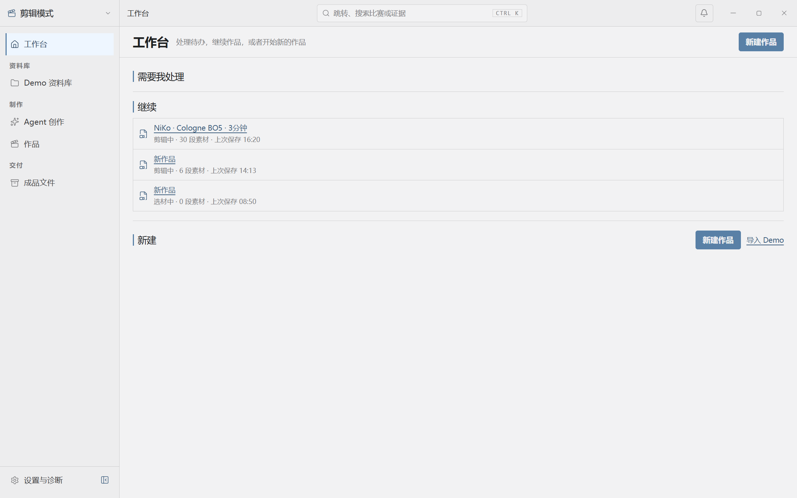
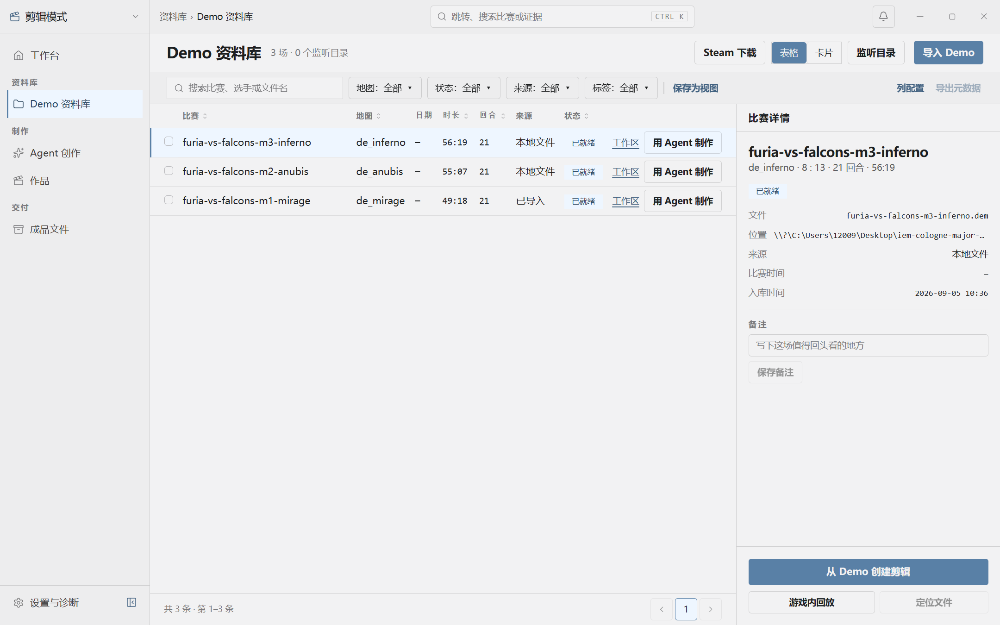
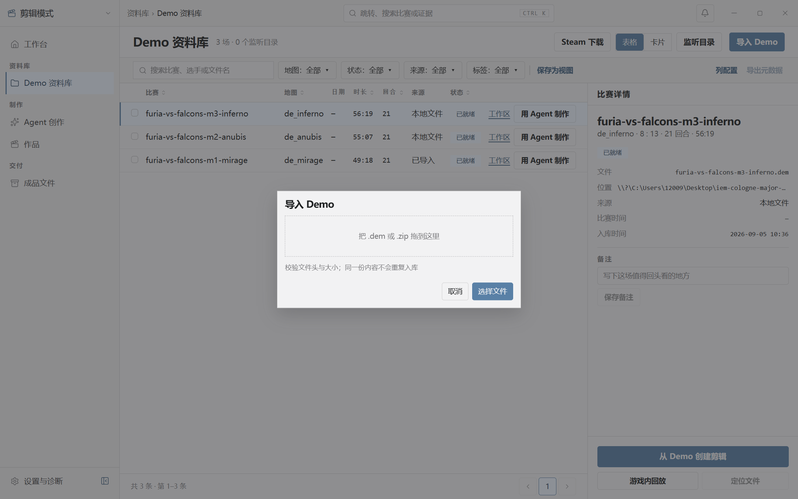
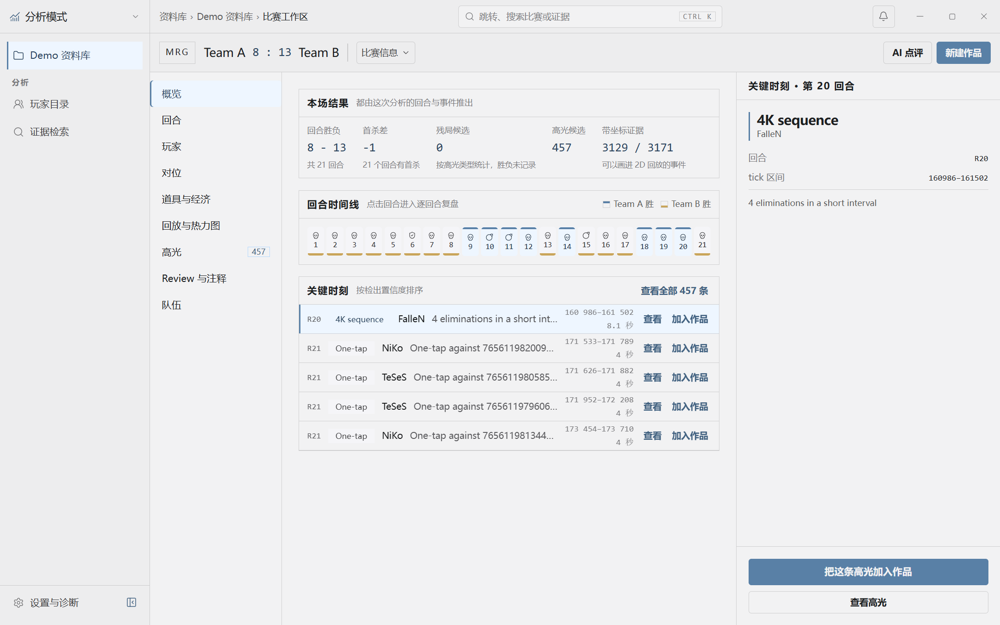
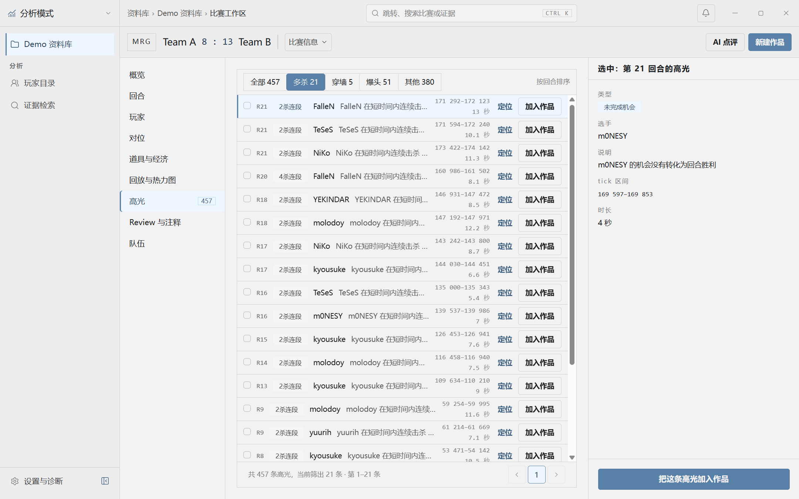
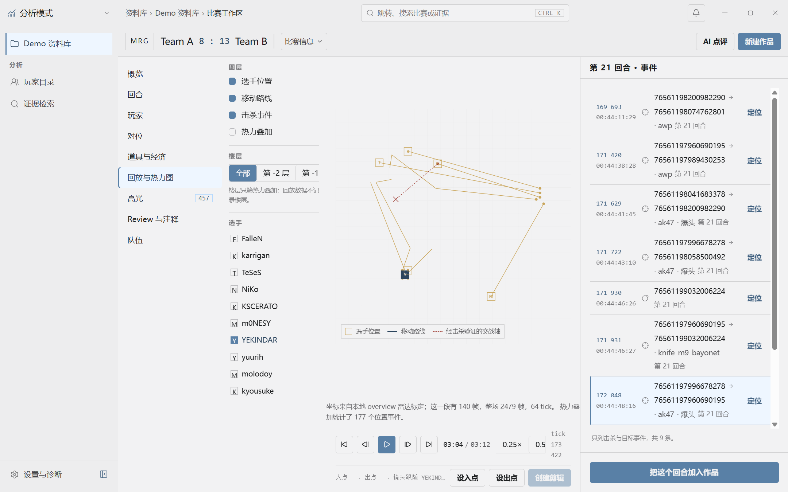
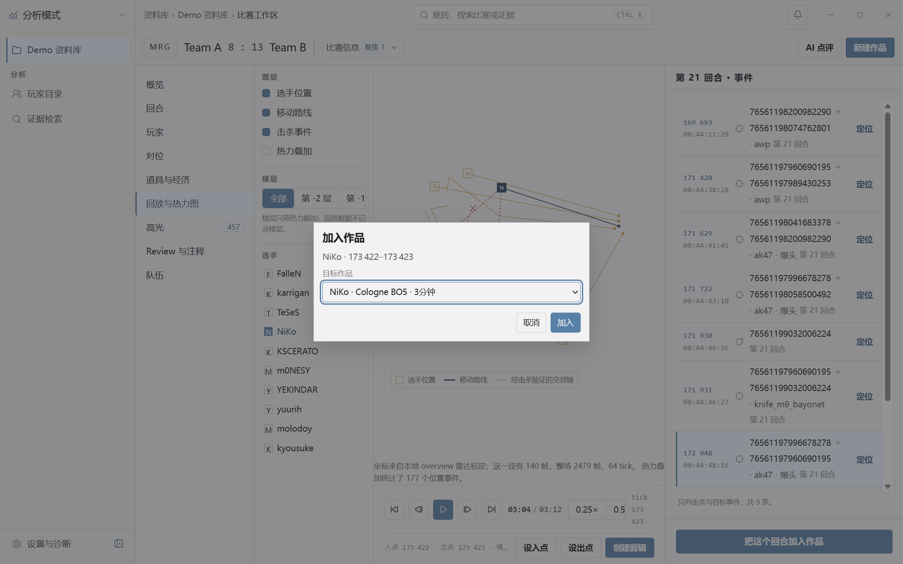
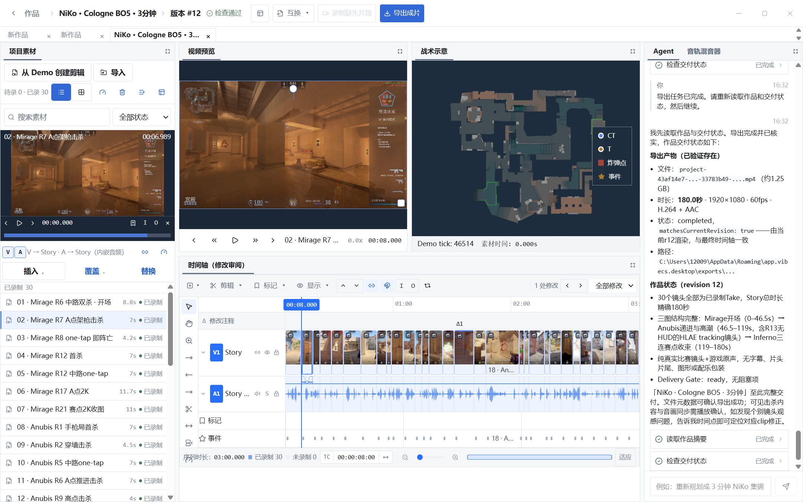
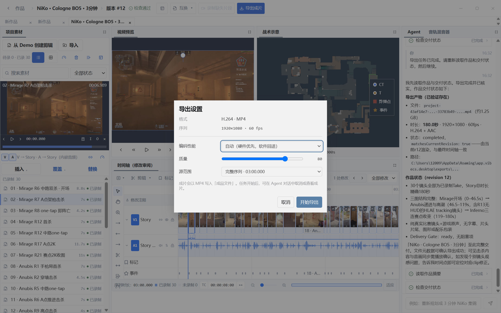
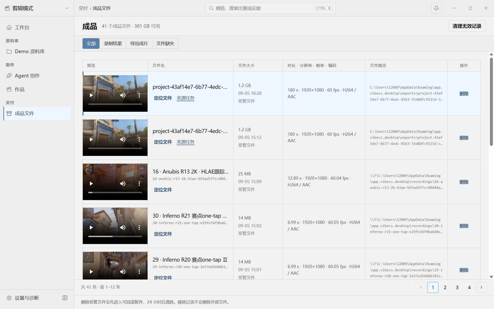

# Vibe CS：真实创作流程审查与模块设计

审查日期：2026-09-05；同步更新：2026-09-06。状态：**已按用户要求在新文件从当前产品重新写入，不走旧文件迁移。十步现状稿已完成字体、真实图像和主要布局核对；五个组件家族及共享 ProjectTimeline 模块已建立。优化方案画板和新版成片尚未制作。**

## 新账号同步状态（2026-09-06）

- [当前 Figma 文件](https://www.figma.com/design/N05FPVtPTwWV3ONlE48Fwv)：`00 · 流程审查` 已放置并逐一渲染核对十步原图和可编辑审查文字；`01 · 模块与基础` 已建立并核对 M1–M6 职责图；`02 · 优化方案` 目前只有页面，尚无优化画板。
- 曾收到 `You've reached the Figma MCP tool call limit on the Education plan`。用户要求重试后，读取和实际写入均恢复；主要批处理按约 6.3 秒间隔顺序执行，后续持续成功。服务未提供限额窗口或恢复原因，因此不能认定此前一定耗尽了每日额度。没有调整账号、购买计划或绕过限制。
- 原图仍是独立图片，不冒充可编辑 UI。用户已明确选择从源码和真实桌面重新写入；后续不再访问旧文件，也不需要旧文件分享权限。
- [十步现状稿](https://www.figma.com/design/N05FPVtPTwWV3ONlE48Fwv?node-id=88-2) 已统一为 1440×900，含完整编辑器、导出设置和成品页。编辑器中 33 处图像均来自真实媒体；成品页保留本页 12 个真实原生播放器预览。
- 已建立 Button（80 变体）、Input（16）、MediaRow（24）、ToolResult（12）、TimelineClip/Video（8）五个家族，以及独立派生音频样式。颜色/尺寸共 133 个变量、17 个文字样式、3 个阴影样式。变量代码语法齐全、无 `ALL_SCOPES`、未发现断链别名或重复变体名。
- 现状稿已接入 64 个素材行、45 个常用按钮、4 个输入框和 56 个折叠完成态工具卡。编辑和导出共用一个 ProjectTimeline 主组件；复杂轨道、Placement、真实波形和修改审阅层保持完整，不另造时间几何。部分捕获内层仍保留原结构，并非每个节点都重新组件化。
- 十步画板均未发现缺失字体，使用已获批准的 Noto Sans SC 与 Roboto Mono。已修正长路径/行内代码重叠、时间码换行、楼层按钮挤压、成品表格分隔线及选中控制柄颜色问题。
- 16 个已被现状稿替代的临时捕获根节点已清理；独立原始截图、审查注释和最终画板保留。原生播放器预览和质量滑块以保真图像保留，不能当成可交互的 Figma 播放器/滑块。
- 旧 Figma 与 Penpot 文件保留。没有删除设计、改变产品实现或修改 revision 12 的旧成片。
- 以下十步审查仍是实际产品证据；新文件节点索引见第 5 节。旧账号的 Starter 限制已不作为当前阻塞依据。

## 1. 范围与交付状态

用户目标：从三场真实 CS2 Demo 中制作 NiKo 三分钟集锦，能选材、核对、修剪、录制、查看进度、导出并识别最终成品。保持纯比赛画面与游戏原声，不增加字幕、片头片尾、图形或配乐包装。

本次使用真实 Tauri 桌面、现有项目和新截取的画面，CSS 视口 1440×900，DPR 1.5，原图 2160×1350。没有以静态网页或模拟数据代替桌面流程。打开了入出点创建对话框与导出设置，但都取消，未执行添加或重复导出。

- [当前 Figma 文件](https://www.figma.com/design/N05FPVtPTwWV3ONlE48Fwv)：十步原图和审查已写入；可编辑重建进度见上方。
- 已完成十步现状稿的主要视觉核对，并连接核心共享组件；保留字体回退、原生控件图像和捕获内层结构的边界。不能称为所有节点均手工重建或像素级完全一致。
- 用户已同意可编辑稿使用项目回退字体 Noto Sans SC；原图保留 Windows 实际字体。不要把回退字体与原图完全等同。
- 新文件已有变量、文字样式、五个组件家族和共享时间轴模块；优化画板尚未制作，Code Connect 未配置或发布。
- 原有作品 revision 12、180 秒时间轴与成片保留。本次没有修改影片或产品行为；效果优化目前是下述待实施方案。
- 临时 HTML 捕获脚本已移除；没有将远程捕获脚本留在生产入口。

## 2. 用户旅程：证据、优点与问题

以下优先级 P1 指会影响目标理解、操作对象或核心工作效率；P2 指可读性和次级体验。视觉观察与根因推断分开，未提交动作的风险不当作已确认错误写入。

### 01 · 工作台：继续作品或开始创作 — 需要调整

优点：已有继续作品、导入 Demo 等清楚的入口。问题：新建入口重复；空的“需要我处理”区域占空间；Agent 创作与作品入口之间的关系不清楚。

P2 建议：已有项目时以“继续 NiKo 集锦”为主操作；新用户以“导入 Demo”为主操作。空待办收为一行说明，不占独立大区。Agent 是作品中的协作方式，不要求用户先理解两种创作入口。

### 02 · Demo 资料库：选择比赛 — 需要调整

优点：状态、比赛和工作区入口齐全。问题：主页“导入 Demo”先跳资料库，仍需再点导入；选中对象的操作分散在行内、详情区与底部；长路径和重复文件名挤占可用空间。

P1 建议：导入入口直接打开同一个导入对话框；选择条目的主操作固定为“查看高光”，保留目标作品和目标选手。路径在详情中按需显示。

### 03 · 导入 Demo：了解接下来会发生什么 — 基础清楚

优点：拖放区、支持格式和去重说明清楚。P2：补一句“导入后会分析比赛，完成后可选高光”；批量导入进度、失败项重试需另行执行验证，本轮没有重新导入源文件。

### 04 · 比赛概览：从统计转向创作 — 需要调整

进入比赛后变成分析模式，作品导航消失；双侧栏与详情区压缩内容；Team A/B、英文高光标题及长 ID 增加识别成本；既定 NiKo 目标未明显延续。

P1 建议：创作流程进入比赛时保留“当前作品 / NiKo”上下文，优先展示高光与回放，深入统计为次级入口。队名缺失应明确说明，不能从文件名推测成权威队名。

### 05 · 高光筛选：核对选中对象 — 高优先级

优点：类型筛选能缩小候选集。已观察：切换到多杀过滤后，列表视觉高亮为 FalleN 2K，右栏仍展示 m0NESY 的未完成机会。此时“把这个高光加入作品”的目标易误读；本轮未点提交，不能断言实际添加了错误事件。

P1 建议：列表、详情和主操作使用同一个稳定选中 ID；选中项被筛除时清空或明确保留提示。将选手筛选放在类型筛选旁，沿用 NiKo。区分事件分数与镜头可看性，不能凭多杀分数自动认定画面精彩。

### 06 · 回放：定位、选择主角、设置入出点 — 高优先级

已观察：高光“定位”只更新 URL 的回合/tick，仍需手动切换回放；进入回放时跟随对象仍为 YEKINDAR，而来源高光主角为 NiKo。地图显示路线与坐标网格但缺少地图纹理，多个楼层按钮和底部播放控件被横向挤压。事件栏用 Steam ID 而不是选手名。画面已稳定且播放可用，不把这些现象解释为加载占位。

P1 建议：一次“在回放中查看”带上主角、回合、tick 并打开相应视图；地图为主区域，图层默认折叠，事件栏按需展开。固定可见的入出点、时长和创建操作。地图纹理缺失需要后续独立诊断，不通过设计稿伪造其已正常。

### 07 · 加入作品：确认范围与去向 — 需要调整

优点：目标作品下拉清楚，并预选当前 NiKo 项目。观察：摘要仅显示“NiKo · tick–tick”，没有地图、回合或人可读时长；多个未命名项目都显示“新作品”。为了查看对话框，本轮设置相邻两个 tick 并取消，没有实际添加。

P2 建议：摘要展示“Mirage · R21 · NiKo · 持续时长”；位置说明为“追加到 Story 末尾”或明确选择的位置。重复名称附更新时间/缩略图帮助区分。短范围是否可接受应按真实能力验证，不随意引入拍脑袋最小时长限制。

### 08 · 编辑与 Agent：预览、修剪并核对修改 — 高优先级

优点：真实视频、战术图、片段缩略图、音频波形及版本 #12 都可见；单一时间轴已能承载工作。问题：源预览、节目预览、战术图、素材列表、修改审阅轨和 Agent 长回复默认同时展开，主要画面过小。整个 180 秒放进窄时间轴后，多数片段名称不可读。Agent 回复用技术字段和完整路径解释交付，摘要卡与对话正文重复。修改审阅与普通剪辑状态的区别不够明显。

P1 建议：保留可停靠布局，但按当前任务给出明确默认布局：

- 选材：素材与源预览优先；节目预览为参照，战术图按需展开。
- 精剪：节目预览与时间轴优先；素材源预览收起；Agent 可收起但保留进行中/待确认状态提示。
- 审阅 Agent 修改：显示此次影响片段及前后差异，提供同一修改组的保留/撤销；结束后退出修改审阅。
- 一个时间轴、一套 transport；面板显隐不能另建编辑状态、播放状态或几何实现。

P2：工具结果默认一句结论 + 当前状态 + 可用操作，细节折叠。技术字段放诊断，不在主结论出现 `matchesCurrentRevision`。录制失败项显示失败镜头、原因与重试范围；本轮没有启动新的录制或 HITL，不将历史记录视为新执行测试。

### 09 · 导出设置：确认本次输出 — 基础清楚

优点：格式、分辨率、帧率、源范围及开始按钮简洁。P2：质量“80”缺少含义；当前导出版本未出现在确认摘要；任务开始后的入口仅通过一句话指向 Agent 对话。

建议：主摘要为“NiKo 集锦 · 版本 12 · 完整序列 03:00 · 1080p60”。质量滑条给出清楚的高低含义，不虚构未测量的体积或耗时。导出开始后在同一工作区提供可见任务状态和查看成片入口，Agent 只投影同一任务。

### 10 · 成品：辨认当前交付 — 高优先级

优点：两份 180 秒输出均加载到 readyState 4，无媒体错误；定位文件与来源任务可访问。问题：两份输出的主标题都是截断 UUID 文件名，同样大小与时长，没有醒目的作品名称、导出版本及是否匹配当前版本；完整路径占据一整列。录制中间结果与最终成片默认混排。

P1 建议：主标题用作品名，旁边展示“版本 12 / 当前版本”；旧导出显示其真实版本和“不匹配当前版本”，不能只按创建时间判定。默认突出成片，录制结果保留独立筛选。路径折叠，删除降为次级操作。文件名可以继续唯一化，不需要因此重命名或删除实际文件。

## 3. 按产品职责划分模块

不是把每个现有页面当成独立模块；按用户动作、事实来源和状态边界划分，保留已有单一生产实现。

| 模块 | 用户任务与主要操作 | 输入与事实来源 | 关键状态 | 验收标准 |
|---|---|---|---|---|
| M1 作品与创作上下文 | 新建/继续作品，选择目标选手与比赛 | Project Head、来源 Demo、用户选择 | 无作品、编辑中、已导出、当前版本变化 | 进入比赛/回放后目标不丢失，返回原作品只需一次明确动作 |
| M2 Demo 与证据选材 | 导入、按选手/事件筛选、预览证据、加入作品 | Demo 分析结果与稳定证据 ID | 导入中、分析中、就绪、失败、过滤无结果 | 同一个选中 ID 驱动列表/详情/加入动作，来源主角带入回放 |
| M3 镜头与素材 | POV/跟踪意图、Capture 范围、录制 Take、源入出点 | Timeline Clip identity、capture intent、material | 待录、录制中、已录、过期/失效、失败 | 明确区分录制范围、素材余量与成片使用范围；改意图后旧 Take 不被误标当前 |
| M4 编辑与预览 | 组接、移动/修剪/分割、播放、撤销、审阅修改 | 统一 Editing Document、ProjectTimeline、Timeline Transport | 普通编辑、播放、手势中、修改审阅、Edit Lease 只读 | 一次完成手势一个 Human Edit；Story ripple；节目与战术图跟随同一播放头 |
| M5 Agent 协作 | 提交创作意图、看工具进度、停止、允许/拒绝、定向撤销 | 一个 Rust Agent runtime、AgentSession、Conversation Projection、HITL/Lease | 空闲、执行、等待确认、失败、停止、完成 | 主操作对象/影响范围清楚；停止与撤销含义分开；不增第二套任务/对话状态 |
| M6 任务与交付 | 录制/重试、导出、确认当前版本、查看/定位成品 | Recording/Export jobs、Project revision、Delivery Gate | 排队、运行、失败/部分成功、完成、产物缺失、旧版本 | 导出版本可追溯；当前版本匹配由真实字段判断；重试范围明确；保护旧输出 |

基础视觉层继续使用 `design/theme.css`、`design/review` 与现有 primitives。时间几何只使用 `design/timeline`；不会因为 Figma 模块拆分而建立平行业务模型。

代码落点：`ProjectMediaPanel.tsx` → M3；`ProjectTimeline.tsx` / `TimelineProgramMonitor.tsx` / `ProjectWorkspaceDock.tsx` → M4；`ProjectAgentPanel.tsx` → M5；`pages/DeliveryPage.tsx` 与 `pages/delivery/OutputCard.tsx` → M6。这些是实施定位，不是已经修改。

## 4. 效果优化：先改善镜头选择与节奏

本轮**未制作新的优化成片**。保留已经验证的 revision 12；以下是下一轮的具体剪辑方向，不是已完成结果。

1. 开场 A/B：现有 Mirage R6 开场与 R17 A 点双杀对比，选择目标更清楚、有效动作更早出现的一段。不要凭高光分数或名称自动替换。
2. 中段节奏：重点复看 01:42–01:59 的 17 秒 Anubis R21 双击杀窗口；保持交战因果和末次击杀尾巴，判断中间空档是否需要切掉。缩短后不能靠重复事件或无内容停留凑满三分钟。
3. 跟踪镜头：复看 01:26–01:36，判断机位是否帮助理解交战；如果不如 POV 清楚，缩短或换为真实可读 POV。不要为了展示 HLAE 能力而保留弱镜头。
4. 统一评估：已验证事件、可见目标、动作起点、击杀尾巴、烟雾遮挡、重复事件、原声音画衔接。只给当前真实素材写结论，不虚构“精彩度检测”能力。
5. 交付：优化后的真实时间轴和输出另行留档，与旧成片对比；再验真实播放、时长、片尾、音画衔接。不得覆盖旧输出或修改源 Demo、游戏配置。

## 5. Figma 文件结构与后续实施顺序

计划控制在三个页面，模块用清楚的 Section，而不是创建一整套无关组件库：

1. `00 · 流程审查`：十步真实截图、可编辑审查文字和十步现状稿。
2. `01 · 模块与基础`：M1–M6 职责/交接、颜色与字级说明；五个相关组件家族用独立 Section：Button、Input、MediaRow、TimelineClip、ToolResult。
3. `02 · 优化方案`：先解决选中对象一致性、目标延续、编辑布局与成品版本识别；再做必要默认/空/执行/失败/确认状态，不新增无关页面。

Figma 现有节点（已由工具返回确认）：

| 步骤 | 新文件可编辑捕获 / 面板 | 状态 |
|---|---|---|
| 01 工作台 | 344:204 | 字体、布局及主按钮实例已核对 |
| 02 Demo 库 | 344:365 | 字体、布局、按钮及备注输入框已核对 |
| 03 导入 | 344:710 | 含导入对话框，未执行导入 |
| 04 比赛概览 | 344:1069 | 现状及真实数据保留 |
| 05 高光 | 344:1602 | 保留实际选中错配证据，不把建议伪装成现状 |
| 06 回放 | 344:2243 | 楼层控件挤压已修正；现有地图问题保留 |
| 07 加入镜头 | 344:2883 | 含加入对话框，未提交加入 |
| 08 编辑器 | 88:3 | 完整拼装，共享时间轴模块及真实媒体已核对 |
| 09 导出 | 353:2 | 含导出设置、原生质量滑块图像，未触发新导出 |
| 10 成品 | 360:47 | 含 12 个真实播放器预览及表格分隔线 |

新文件页面：审查 `0:1`、模块与基础 `1:2`、优化方案 `1:3`。十步原图及注释在证据 Section `1:4`；现状稿 Section 为 `88:2`。TimelineClip 区块为 `443:1737`，共享 ProjectTimeline 主组件为 `452:2494`。优化方案页目前为空。旧 Figma/Penpot 文件未改动；新文件中的临时捕获副本已清理。

### 源码配色的对比度观察

以下为源码颜色的数学对比度，不是完整 WCAG 认证。现状稿保持源码值；低对比度文字与按钮应在优化稿中另行处理。

| 用途 | 前景 / 背景 | 对比度 |
|---|---|---:|
| Shell 主按钮 | `#f2f2f3` / `#5980a6` | 3.71:1 |
| Shell 次要文字 | `#98989b` / `#f2f2f3` | 2.57:1 |
| Workbench 主按钮 | `#ffffff` / `#3268d6` | 5.14:1 |
| Workbench 次要文字 | `#7a8597` / `#ffffff` | 3.73:1 |

普通按钮的源码尺寸为 32/34/38/42 px，焦点与禁用态已在变体库中呈现。细窄 Timeline Clip 的实际命中、键盘等效操作和完整可访问性仍需生产 UI 的专项回归，不能靠静态画板证明。

### 优先级与完成条件

- P1 首轮：高光选中一致性、回放上下文、回放布局/地图问题、编辑主次布局、成品版本识别。
- P2 次轮：重复入口、长 ID/路径、人可读时长、工具结果摘要、质量说明。
- 实施前：先在 Figma 保留“现状”和“建议”两套清楚标记的画板，完成同视口视觉核对；不把优化稿冒充现有产品。
- 实施后：用真实用户路径回归，确认状态来源仍唯一；补实际生产入口的回归测试，不为截图引入伪数据或平行时间轴。

## 6. 验证边界

本次是视觉与用户流程审查，不是完整 WCAG 认证。导入、实际添加、录制、失败重试、当前 HITL 和新导出均未在本轮重新执行；这些步骤的历史成功不能替代新状态的验收。高光错配目前是已确认的视觉/上下文问题，底层写入对象需要独立复现。十步现状稿和核心组件已完成上述检查；优化稿、生产 UI 改动和新版成片仍未实施。折叠工具卡未采集的展开数据明确标记为未采集，不填入虚构结果。

## 7. 2026-09-06：本地/Figma 偏差与整套 UI 重设计

用户要求先对齐本地与 Figma，再基于 Figma 设计系统重设计整个 UI，最后更新代码。风格已确认采用统一、清晰的浅色蓝灰。用户进一步确认：剪辑模式服务创作者，分析模式服务数据分析；两者都必须得到完整支持。

使用已审阅的 Impeccable 4.2.1 布局和字体方法，并结合 Figma 的组件/变量流程。不启用自动修改 hooks。本轮开始前已对当前前端及依赖清单制作 ZIP 快照，保留已有未提交修改。

### 新确认的偏差

比较均按 1440 × 900 逻辑视口归一化；本地截图为 DPR 1.5，不直接比较原始像素坐标。两张图的 Agent 滚动位置不同，不把消息差异判为数据丢失。

| 问题 | 证据 | 处理方向 |
|---|---|---|
| 字体没有同一权威 | 本地系统中文字体/Consolas；Figma Noto Sans SC/Roboto Mono | 设计与实现使用同一可获得的 UI/等宽字体及语义字级 |
| 原生滚动条占位遗漏 | 素材外框 312.385 px；本地行宽 297.052 px，Figma 行宽 312.385 px | 在设计中计入 15.333 px 占位，并明确共享滚动区域与内容对齐边缘 |
| Agent 内容宽度不同 | 本地卡片 248.135 px；Figma 卡片 263.469 px | 同步内容区宽度、字体及滚动状态后再验 |
| 剪辑预览主次不足 | Program 与 Tactical 默认各占监视器行的 50% | 剪辑模式突出 Program；分析模式突出数据和战术回放 |
| 面板带状区域高度不一致 | 通用面板标题、Dock 页签和 Agent 标题分别使用不同尺寸 | 统一标题、命令栏、内容内边距和页脚角色 |
| 低频动作与主动作竞争 | ghost 按钮默认蓝色，素材头部多组命令同等突出 | 普通动作中性化，强调色留给主动作、选中和焦点 |
| 长文本密度过高 | Agent 正文使用紧凑 text-xs；窄素材行重复显示录制状态 | 正文与工具摘要分级；素材名称优先，保留必要异常状态 |

现状稿编辑器及导出背景的素材列表已写入滚动条占位和 64 个素材行的宽度修正，尚待截图复核。Agent 和字体差异仍未全部校准。前文“已核对”只代表上一轮检查，不能作为整套本地/Figma 像素一致性结论。

重设计及生产代码实施尚未完成。完成条件包括：共用语义 tokens 和基础组件、两种模式的代表性画板、现有页面/状态覆盖、同视口截图比较，以及真实编辑和分析入口的行为回归。不得仅修改主题色便宣布整个 UI 重设计完成。
