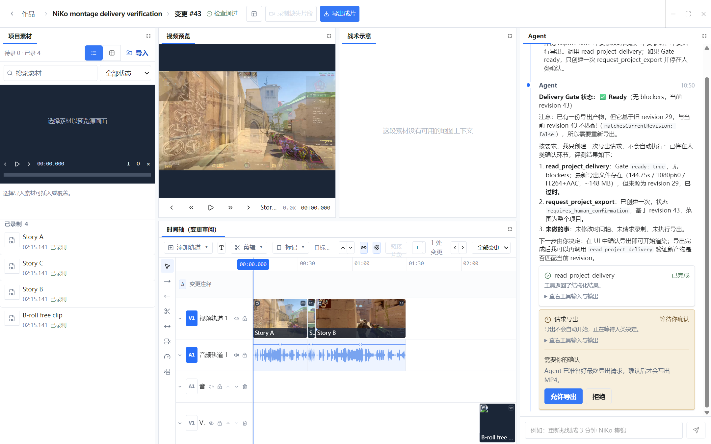
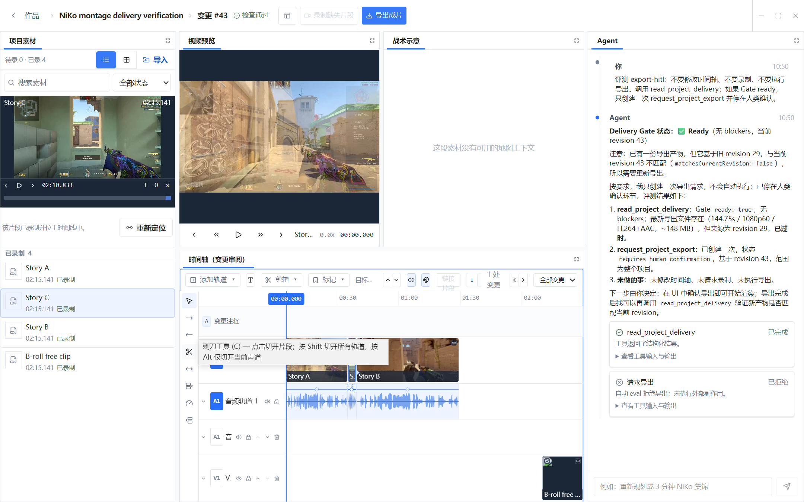
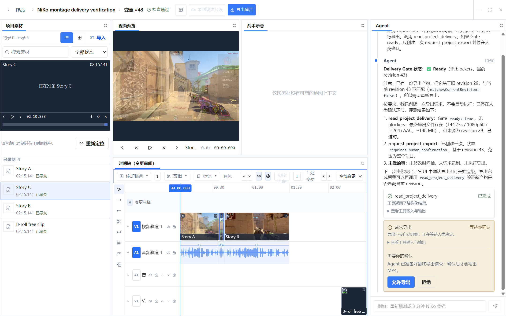
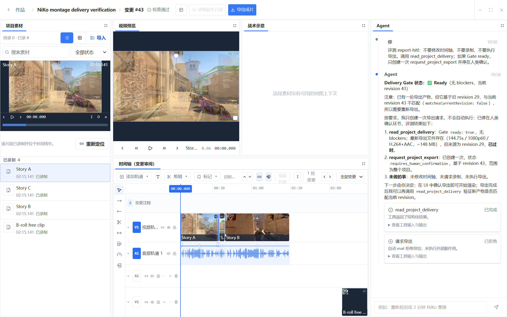
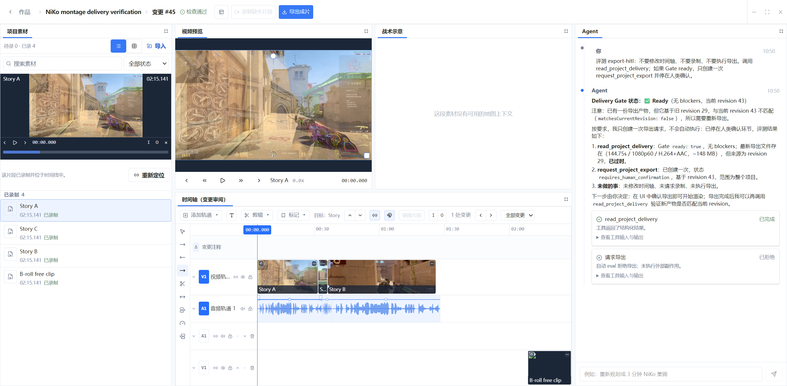
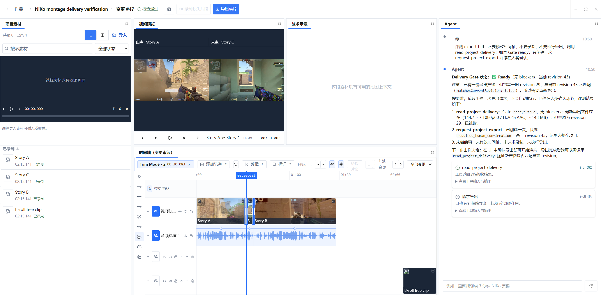
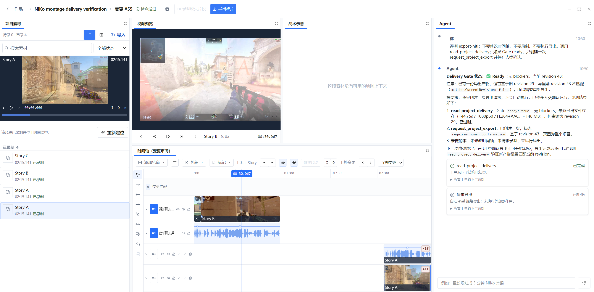

# Vibe CS 统一时间轴产品需求文档

| 字段 | 内容 |
| --- | --- |
| 文档状态 | Active / 迭代基线 |
| 产品状态 | UNRELEASED |
| 负责人 | Product + Editing |
| 基准产品 | Adobe Premiere Pro Desktop |
| 审计日期 | 2026-09-01 |
| 实现范围 | `domain/editing/ProjectTimeline`、Program Monitor、Project Media、Inspector、Project Change Groups |

## 1. 背景与问题

Vibe CS 需要的不是“能摆几个片段”的演示时间轴，而是一套可以承载真实剪辑、录制、导出和 Agent 协作的统一编辑界面。Adobe Premiere Pro 是交互和能力基准；Vibe CS 不复制其视觉皮肤，但应复用成熟的编辑概念、快捷键和可预期行为。

当前产品已经具备较深的直接编辑能力，但过去的开发是逐项补齐，缺少一份完整、可验收的产品基线。结果是：已经实现的能力不容易被看见，缺口的优先级不明确，新功能也容易绕过统一 Timeline Module。

本文档解决三个问题：

1. 定义一个完整时间轴必须支持的操作集合。
2. 逐项标记 Vibe CS 当前实现状态与偏差。
3. 把缺口组织为可连续交付的产品里程碑。

## 2. 产品目标

### 2.1 用户目标

- 人类剪辑师可以只使用一个统一工作区完成素材选择、组接、精剪、音频、审阅、录制和导出。
- 熟悉 Premiere 的用户不需要重新学习最基本的时间轴心智模型和快捷键。
- Agent 使用同一个 Project Head 和同一套编辑操作，可以一次重排整个 Story，也可以做精确的单片段修改。
- Agent 持有 Edit Lease 时，人类仍能浏览、播放和检查，但所有修改入口明确只读。
- 每次完成的手势只产生一个可撤销 Change Group；拖动预览不写入中间状态。

### 2.2 业务目标

- 时间轴上不存在“看起来可点但没有行为”的控件。
- 所有录制、预览、导出和 Agent 工具都消费相同的 Timeline Clip identity。
- 任何导出都可追溯到明确的 Project revision。
- 通过自动化交互测试覆盖所有 P0/P1 编辑命令和快捷键。

### 2.3 非目标

- 不克隆 Premiere 的菜单结构、颜色或面板皮肤。
- 不引入第二套时间轴模型、兼容层或插件式编辑引擎。
- 不在本阶段实现 Premiere 的每一种专业格式、第三方特效或广播交付能力。
- 不用通用工作流引擎替代 Project Patch、Change Group、Edit Lease 和 Agent Session。

## 3. 关键产品决策

### 3.1 一个权威编辑文档

时间轴、Program Monitor、Tactical Monitor、Inspector、录制、导出和 Agent 都读取 canonical Editing Document。任何可见修改必须通过 Project Patch 写回 Project Head。

### 3.2 Story 与自由轨的语义差异

- Story Track 是成片叙事主轨：移动、修剪、切分和删除采用波纹语义并闭合间隙。
- 其他视频、音频和文字轨默认自由定位，不因为普通删除自动闭合间隙。
- 后续的 Sync Lock 明确控制 Story 波纹是否带动其他轨道；不能暗中把所有轨道改成 Story。

这与 Premiere 的“Clear”和“Ripple Delete”可分别选择不同：Vibe CS 在 Story 上有意选择 gapless 默认值，必须在 UI 和文档中明确。

### 3.3 Program Monitor 从属于 Transport

Program Monitor 不拥有独立播放条。时间轴播放头是唯一 Transport authority；媒体池保持稳定挂载，seek 合并到最新目标，替换帧准备好之前保留上一帧。

### 3.4 Agent 是编辑者，不是第二套界面

- Agent 工具调用、输出和 HITL 是一个对话流。
- Agent 改动直接显示在时间轴位置上，而不是另建“建议时间轴”。
- Agent 可以原子地重排整个 Story；人类直接操作仍按完成手势提交。
- Agent 操作期间人类只读；HITL 结果显示在对应 Tool UI 内。

### 3.5 素材状态是时间轴的一等信息

Timeline Clip 必须明确显示 Planned、Recorded、Imported、Stale/Needs Recording 等物化状态。未录制片段仍然是真实 Timeline Clip，不使用占位模型。

## 4. 用户与核心任务

| 用户 | 主要任务 | 成功标准 |
| --- | --- | --- |
| 人类剪辑师 | 组接并精剪 NiKo 集锦 | 不离开统一工作区即可完成 3 分钟 Story、音频和交付 |
| 人类审阅者 | 检查 Agent 修改 | 在变化发生的位置理解新增、删除、时长和波纹影响，并可撤销 Change Group |
| Agent | 分析 Demo、重排时间轴、请求录制/导出 | 渐进读取必要上下文，原子提交，等待 HITL 时不产生外部副作用 |
| 录制/交付操作者 | 补录缺失镜头并导出 | 每个输出绑定当前 revision，过期输出不会伪装成当前交付 |

## 5. 交互原则

1. **焦点决定快捷键作用域。** Timeline 获得蓝色焦点状态后，Space、JKL、剪辑和导航快捷键才作用于 Timeline。
2. **播放头不拖动片段。** 标尺或播放头拖动只改变时间；选中片段保持原位。
3. **预览与提交分离。** Pointer Move 只更新 draft；Pointer Up 提交一个 Project Patch；Cancel 恢复原值。
4. **帧对齐。** 所有播放头、移动、修剪、转场、标记和关键帧时间都吸附到项目 fps 的帧网格。
5. **吸附可见。** 吸附到片段边缘、标记或播放头时显示单一垂直 guide；Shift 临时反转当前手势的吸附行为。
6. **锁定是硬边界。** 锁定轨可以被查看和选中，但不能被移动、修剪、删除、粘贴、链接或 Agent 局部编辑。
7. **没有死按钮。** 不可用命令保持禁用，并在 Hover/Focus 说明原因；可用命令必须有真实结果和回归测试。
8. **操作可逆。** 人类和 Agent 的完成编辑都进入同一 Change Group 历史；Undo/Redo 不能只在本地伪造。

## 6. 状态定义

| 标记 | 含义 |
| --- | --- |
| ✅ 已实现 | 当前生产路径存在，并有代码或交互测试证据 |
| 🟡 部分实现 | 主路径存在，但少了 Premiere 基线中的重要子能力 |
| ⬜ 未实现 | 当前生产路径中没有该能力 |
| ⛔ 有意不采用 | 与 Vibe CS 产品模型冲突，保留明确差异 |

优先级：P0 阻断可靠剪辑或可逆性；P1 是完整剪辑器核心；P2 是专业效率；P3 是高级/特定工作流。

## 7. 功能需求与当前实现审计

### 7.1 面板、焦点与显示

| ID | 能力 | 产品要求 | 状态 | 优先级 |
| --- | --- | --- | --- | --- |
| TL-UI-01 | 全高 Project 面板 | 素材库全高停靠，支持列表/图标、搜索、状态筛选 | ✅ | P0 |
| TL-UI-02 | 可停靠工作区 | Project、Program、Tactical、Timeline、Agent 可分栏、停靠、合并 Tab、调整尺寸、最大化和重置 | ✅ | P0 |
| TL-UI-03 | Timeline 焦点 | 指针操作后 Timeline 获得键盘焦点；面板焦点有明确视觉状态 | ✅ | P0 |
| TL-UI-04 | 统一浅色设计系统 | 使用 `theme.css`、`design/timeline`、`design/review`，无页面私有时间几何 | ✅ | P0 |
| TL-UI-05 | 轨道高度 | 单轨展开/折叠、拖动高度，视频缩略图和波形随高度重排 | ✅ | P1 |
| TL-UI-06 | 轨道显示设置 | 切换片段名称、缩略图、波形、关键帧、重复帧/Through Edit 标记 | ✅ | P2 |
| TL-UI-07 | 时间码输入 | 播放头时间码可点击输入、拖动 scrub、切换时间码/帧计数 | ✅ | P2 |
| TL-UI-08 | 工具说明 | 所有工具 Hover/Focus 显示名称、快捷键、行为或不可用原因 | ✅ | P0 |

### 7.2 时间导航、缩放与滚动

Premiere 的标尺、播放头、Work Area 和底部 Zoom Scroll Bar 行为参考 Adobe 的 [Timeline navigation controls](https://helpx.adobe.com/premiere/desktop/edit-projects/change-clip-sequence/navigation-controls-in-the-timeline.html)、[Navigate sequences](https://helpx.adobe.com/premiere/desktop/edit-projects/change-clip-sequence/navigate-sequences-in-the-timeline.html) 与 [Timeline preferences](https://helpx.adobe.com/premiere/desktop/get-started/preferences-and-settings/timeline-preferences.html)。

| ID | 能力 | 产品要求 | 状态 | 优先级 |
| --- | --- | --- | --- | --- |
| TL-NAV-01 | 标尺与播放头 | 标尺点击/拖动、播放头拖动、全轨垂直线、帧对齐 | ✅ | P0 |
| TL-NAV-02 | 播放头吸附 | Shift-drag 临时吸附到片段边缘和标记，不移动片段 | ✅ | P0 |
| TL-NAV-03 | 缩放按钮/快捷键 | `=`/`+` 放大，`-` 缩小，保持播放头或指针下的时间 | ✅ | P0 |
| TL-NAV-04 | Fit | `\`、适应按钮、完全展开 Zoom Bar 都显示完整序列；长序列允许低于普通缩放阶梯 | ✅ | P0 |
| TL-NAV-05 | Zoom Scroll Bar | 中间拖动平移；两端拖动缩放；不移动播放头 | ✅ | P0 |
| TL-NAV-06 | Windows 滚轮 | 普通滚轮只水平；Ctrl 临时只垂直；到边界不切换轴；Alt 围绕指针缩放 | ✅ | P0 |
| TL-NAV-07 | 页面滚动 | Page Up/Down 左右移动一个可视页 | ✅ | P1 |
| TL-NAV-08 | 播放跟随 | 默认 Page Scroll；播放头离开页面才翻页；暂停导航只做最小 reveal | ✅ | P0 |
| TL-NAV-09 | Smooth Scroll | 可选让播放头固定在中间，内容连续滚动 | ✅ | P2 |
| TL-NAV-10 | 手形/缩放工具 | H 拖动画布、Z 点按缩放，作为 Zoom Bar 的等价入口 | ✅ | P2 |
| TL-NAV-11 | 手势边缘滚动 | 拖片段、修剪、框选接近边缘时水平/垂直自动滚动 | ✅ | P1 |

### 7.3 Transport 与定位

| ID | 能力 | 产品要求 | 状态 | 优先级 |
| --- | --- | --- | --- | --- |
| TL-TR-01 | 播放/暂停 | Space 和 Program 按钮调用同一 Transport | ✅ | P0 |
| TL-TR-02 | 帧步进 | Left/Right 一帧，Shift 五帧；Program 上一/下一帧一致 | ✅ | P0 |
| TL-TR-03 | J/K/L Shuttle | J 反向、K 停止、L 正向 | ✅ | P0 |
| TL-TR-04 | 多级 Shuttle | 重复 J/L 提升速度；K 停止；连续按键提升到 4× | ✅ | P2 |
| TL-TR-05 | 编辑点导航 | Up/Down 在目标轨编辑点间移动，Shift 覆盖全部轨 | ✅ | P1 |
| TL-TR-06 | 入出点 | I/O 设置，显式清除；Lift/Extract/导出消费同一范围 | ✅ | P0 |
| TL-TR-07 | 跳转入出点 | Shift+I / Shift+O，清除单侧和双侧快捷键 | ✅ | P1 |
| TL-TR-08 | 循环播放 | 序列或 In/Out 范围循环 | ✅ | P2 |
| TL-TR-09 | Match Frame | F 从播放头打开最高目标轨的精确源帧 | ✅ | P1 |
| TL-TR-10 | 稳定媒体池 | 切片/拖播放头不重新挂载视频；seek 合并且保留上一帧 | ✅ | P0 |

### 7.4 选择、链接、分组与目标轨

Adobe 的基准行为参考 [Select clips](https://helpx.adobe.com/premiere/desktop/edit-projects/change-clip-sequence/select-clips.html)、[Track Targeting](https://helpx.adobe.com/premiere/desktop/edit-projects/intro-to-editing/work-with-clips-on-the-timeline-using-track-targeting.html) 和 [Sync Lock](https://helpx.adobe.com/premiere/desktop/edit-projects/change-clip-sequence/sync-lock-to-prevent-changes.html)。

| ID | 能力 | 产品要求 | 状态 | 优先级 |
| --- | --- | --- | --- | --- |
| TL-SEL-01 | 单选/加选/范围 | 点击单选、Ctrl/Cmd 加选、Shift 同轨范围选择 | ✅ | P0 |
| TL-SEL-02 | 框选 | 空白处拖动框选，Ctrl/Cmd 增量框选，支持边缘滚动 | ✅ | P0 |
| TL-SEL-03 | 全选/取消选择 | Ctrl/Cmd+A 选择目标轨；Ctrl/Cmd+Shift+A 清空 | ✅ | P1 |
| TL-SEL-04 | Track Select | A 向前、Shift+A 向后；Shift-click 跨全部轨 | ✅ | P1 |
| TL-SEL-05 | Linked Selection | 全局开关；Alt 只选/只编辑一个声道 | ✅ | P1 |
| TL-SEL-06 | Link/Unlink | Ctrl/Cmd+L 与按钮原子更新跨轨 link group | ✅ | P1 |
| TL-SEL-07 | Group/Ungroup | Ctrl/Cmd+G 与 Ctrl/Cmd+Shift+G 写入独立 `group_id`；Group 始终扩展选择和移动，Link 只在 Linked Selection 开启时扩展；复制粘贴继续重建组 identity | ✅ | P2 |
| TL-SEL-08 | Track Targeting | 多目标轨控制 Add Edit、粘贴、导航、转场和 Match Frame | ✅，Match Frame 尚缺 | P0 |
| TL-SEL-09 | Source Patching | Source 视频/音频分别映射目标轨，可禁用某个 source channel | ✅ | P0 |
| TL-SEL-10 | Sync Lock | 每个 canonical 轨道有开关；Shift 点击切换同类轨；Story insert/ripple/extract/trim 用稳定 Clip identity 推导偏移并在同一 Patch 平移未锁自由轨 | ✅ | P1 |

### 7.5 轨道管理

| ID | 能力 | 产品要求 | 状态 | 优先级 |
| --- | --- | --- | --- | --- |
| TL-TRACK-01 | 添加轨道 | 视频、音频、文字轨；Source Patch 缺轨时可同一 Patch 创建 | ✅ | P0 |
| TL-TRACK-02 | 删除轨道 | 非 Story 轨可删除；不删除源文件 | ✅ | P1 |
| TL-TRACK-03 | 重排轨道 | 非 Story 轨上下重排，保持 ID 和片段 | ✅ | P1 |
| TL-TRACK-04 | 轨道锁定 | 锁定轨可看不可改，链接编辑不穿透锁 | ✅ | P0 |
| TL-TRACK-05 | 输出控制 | 视频/文字 Eye，音频 Mute，Program 和导出一致 | ✅ | P0 |
| TL-TRACK-06 | Solo | 单独监听一条或多条音频轨 | ✅ | P2 |
| TL-TRACK-07 | 轨道命名 | 内联或 Inspector 重命名，保持 track ID | ✅ | P2 |
| TL-TRACK-08 | 跨轨移动 | 兼容片段可垂直拖到另一条轨并一次提交；自由轨使用 Overwrite；Story compound 离开 Story 时拆成共享 Link Group 的视频/音频，进入 Story 时重新合并；缺少音频轨时同一 Patch 创建 | ✅ | P1 |

### 7.6 素材组接与三点编辑

Adobe 的 Insert/Overwrite 与 Source Patching 参考 [Add media using Source Patching](https://helpx.adobe.com/premiere/desktop/edit-projects/intro-to-editing/add-media-to-the-timeline-using-source-patching.html)。

| ID | 能力 | 产品要求 | 状态 | 优先级 |
| --- | --- | --- | --- | --- |
| TL-ASM-01 | Project 素材库 | Planned、Recorded、Imported 分组/筛选，搜索、列表/图标视图 | ✅ | P0 |
| TL-ASM-02 | Source Monitor | 源播放、逐帧、源 In/Out、保持上一素材帧直到新源 ready | ✅ | P0 |
| TL-ASM-03 | 拖放组接 | 从 Project 拖到兼容轨；默认 Overwrite，Ctrl/Cmd 为 Insert | ✅ | P0 |
| TL-ASM-04 | Insert | `,` 或 Source 按钮插入并波纹；使用 Source Patch | ✅ | P0 |
| TL-ASM-05 | Overwrite | `.` 或 Source 按钮覆盖时间范围，不移动后续时间 | ✅ | P0 |
| TL-ASM-06 | 三点/四点编辑 | Source In/Out + Timeline In/Out；范围冲突时可选择 Fit 行为 | ✅ | P2 |
| TL-ASM-07 | Cut/Copy/Paste | Ctrl/Cmd+X/C/V；Paste Overwrite 与 Paste Insert；链接关系重建 | ✅ | P0 |
| TL-ASM-08 | Duplicate | Ctrl/Cmd+Shift+/ 在目标位置复制选择 | ✅ | P2 |
| TL-ASM-09 | Replace Edit | 用新源替换选中片段并保留时间位置、长度和效果 | ✅ | P1 |
| TL-ASM-10 | Relink | 源文件改变位置后重连，不改变 Timeline identity | ✅ | P0 |
| TL-ASM-11 | Automate to Sequence | 按 Project 排序/标记批量组接，并可应用默认转场 | ✅ | P3 |

### 7.7 片段移动、删除与范围编辑

| ID | 能力 | 产品要求 | 状态 | 优先级 |
| --- | --- | --- | --- | --- |
| TL-EDIT-01 | 移动 | 拖动片段或选择组；Story 重排并闭合，其他轨自由定位 | ✅ | P0 |
| TL-EDIT-02 | Nudge | Alt+Left/Right 一帧，Alt+Shift 五帧 | ✅ | P1 |
| TL-EDIT-03 | Add Edit | Ctrl/Cmd+K 目标轨，Ctrl/Cmd+Shift+K 全部未锁轨 | ✅ | P0 |
| TL-EDIT-04 | Razor | C 点击切分；Shift 跨轨；Alt 仅当前声道 | ✅ | P0 |
| TL-EDIT-05 | Clear | 删除选择并保留空隙 | ✅ 自由轨；⛔ Story 采用 gapless 产品语义 | P0 |
| TL-EDIT-06 | Ripple Delete | 删除并关闭间隙；Track Lock 阻止修改，Sync Lock 决定其他轨移动 | ✅ | P1 |
| TL-EDIT-07 | Gap 操作 | 选择 gap、Ripple Delete gap、关闭全部 gap | ✅ | P2 |
| TL-EDIT-08 | Lift | `;` 删除目标轨 In/Out 内容并保留范围空隙，同时复制到剪贴板 | ✅ | P1 |
| TL-EDIT-09 | Extract | `'` 删除目标轨 In/Out 内容并闭合范围，同时复制到剪贴板 | ✅ | P1 |
| TL-EDIT-10 | Q/W Ripple Trim | 把选中 Story 起点/终点波纹裁到播放头 | ✅ | P1 |
| TL-EDIT-11 | Extend Edit | 聚焦起点/终点 Trim Handle 明确选择 edit point；E 把它延伸到播放头并复用 Story/自由轨修剪语义 | ✅ | P1 |
| TL-EDIT-12 | Clip Enable | Shift+E 切换所选未锁片段 enabled，Program/导出一致 | ✅ | P1 |

### 7.8 精剪工具

Adobe 工具基准参考 [Tools panel](https://helpx.adobe.com/premiere/desktop/get-started/tour-the-workspace/tools-panel-and-options-panel.html)、[Ripple Edit](https://helpx.adobe.com/premiere/desktop/edit-projects/trim-clips/perform-ripple-edits.html)、[Rolling Edit](https://helpx.adobe.com/premiere/desktop/edit-projects/trim-clips/perform-rolling-edits.html)、[Slip](https://helpx.adobe.com/premiere/desktop/edit-projects/trim-clips/perform-slip-edits.html) 与 [Slide](https://helpx.adobe.com/premiere/desktop/edit-projects/trim-clips/perform-slide-edits.html)。

| ID | 能力 | 产品要求 | 状态 | 优先级 |
| --- | --- | --- | --- | --- |
| TL-TRIM-01 | Selection Trim | 选中片段后拖起点/终点；多选共享受限 delta；Alt 可只改一个链接声道 | ✅ | P0 |
| TL-TRIM-02 | Ripple Tool B | 显式 B 工具；仅在片段边缘命中；拖动期间预览整条轨的后续位移和序列时长；Story 保持 gapless，自由轨保留既有前置间隙；释放时复用 Sync Lock 原子 Patch | ✅ | P1 |
| TL-TRIM-03 | Rolling N | 移动相邻剪辑点，不改变组合时长，显示 Trim Monitor 帧 | ✅ | P1 |
| TL-TRIM-04 | Slip Y | 改变 Source In/Out，不改变 Timeline 位置和时长；支持选择组 | ✅ | P1 |
| TL-TRIM-05 | Slide U | 移动中间片段，同时补偿前后片段，外边界和自身时长不变 | ✅ | P1 |
| TL-TRIM-06 | Rate Stretch R | 拖边改变时长和速度；Story 实时波纹；Inspector 同一语义 | ✅ | P1 |
| TL-TRIM-07 | Time Remapping | 多速度段、边界拖动、Program/Export 同一映射 | ✅ | P2 |
| TL-TRIM-08 | Trim Mode | Shift+T 进入双画面 Trim Monitor；优先使用已聚焦剪辑点，否则取播放头最近 Story cut；±1.5 秒循环预览；Left/Right 1 帧、Shift 5 帧；Ctrl/Shift 点击 Rolling Handle 选择同轨或跨轨多个 edit point，并用共同受限 delta 原子调整 | ✅ | P2 |
| TL-TRIM-09 | Dynamic JKL Trim | Trim Mode 中 J/K/L 使用同一循环 Transport；重复 J/L 加速，K 在停止帧提交 Rolling trim | ✅ | P3 |
| TL-TRIM-10 | Reverse/Freeze | 负速度、反向、Frame Hold/Freeze Frame | ✅ | P2 |

### 7.9 转场、效果与关键帧

转场对齐与复制基准参考 Adobe 官方 [Align and reposition transitions](https://helpx.adobe.com/premiere/desktop/add-video-effects/apply-video-transitions/align-transitions.html) 与 [Copy and paste transitions](https://helpx.adobe.com/premiere/desktop/add-video-effects/apply-video-transitions/copy-and-paste-transitions.html)。

| ID | 能力 | 产品要求 | 状态 | 优先级 |
| --- | --- | --- | --- | --- |
| TL-FX-01 | 默认视频转场 | Ctrl/Cmd+D 在目标 cut 应用；Shift+D 对选择应用 | ✅ | P1 |
| TL-FX-02 | 默认音频转场 | Ctrl/Cmd+Shift+D 应用 Constant Power 语义 | ✅ | P1 |
| TL-FX-03 | 转场对象 | 时间轴内可选择、拖持续时间、双击进入属性；Program/Export 共用类型 | ✅ | P1 |
| TL-FX-04 | 转场 Handles | 按可用源 handles 限制持续时间，缺帧时明确反馈 | ✅ | P1 |
| TL-FX-05 | 效果栈 | 启用/禁用、排序、参数调整；Program/Export 顺序一致 | ✅ 支持当前 renderer-backed 集合 | P1 |
| TL-FX-06 | 关键帧 | Timeline/Inspector 添加、移动、删除，静态值和动画值一致 | ✅ | P1 |
| TL-FX-07 | 插值 | Hold、Linear、Bezier/Ease 与切线编辑 | ✅ | P2 |
| TL-FX-08 | Program 直接变换 | 移动、缩放、旋转；一次手势一次 Patch；锁定只读 | ✅ | P1 |
| TL-FX-09 | Paste Attributes | Ctrl/Cmd+Alt+V 选择性粘贴变换、效果、关键帧、转场 | ✅ | P2 |

### 7.10 音频

| ID | 能力 | 产品要求 | 状态 | 优先级 |
| --- | --- | --- | --- | --- |
| TL-AUD-01 | 波形 | 录制/导入素材生成真实波形；高缩放下不伪造细节 | ✅ | P0 |
| TL-AUD-02 | Clip Gain | dB Rubber Band，拖动和键盘微调，限制与渲染器一致 | ✅ | P1 |
| TL-AUD-03 | Volume Keyframes | Clip/Track 级 Volume keyframe；Program/Export 预览一致 | ✅ | P1 |
| TL-AUD-04 | 音频转场/Fade | 时间轴内调整淡入淡出，使用统一 transition schema | ✅ | P1 |
| TL-AUD-05 | Pan/Balance | 轨道和片段 Pan，关键帧自动化 | ✅ | P2 |
| TL-AUD-06 | Mixer | Track Mixer、Mute/Solo、表头、峰值表、Automation modes | ✅ | P3 |
| TL-AUD-07 | 音画同步提示 | Unlink 时记录最小相对同步参考；单侧移动后双方显示带符号帧差；恢复按钮按另一侧位移对齐，支持 Pointer/键盘并提交一个 Clip operation | ✅ | P2 |

### 7.11 标记、文字、字幕和事件

Adobe Marker 基准参考 [Markers overview](https://helpx.adobe.com/premiere/desktop/organize-media/apply-labeling/overview-of-markers.html)。

| ID | 能力 | 产品要求 | 状态 | 优先级 |
| --- | --- | --- | --- | --- |
| TL-META-01 | Sequence Marker | M 添加，拖动、选择、编辑、删除、上一/下一、清空 | ✅ | P1 |
| TL-META-02 | Marker 属性 | 名称、颜色、注释、持续时间和类型 | ✅ | P2 |
| TL-META-03 | Clip Marker | Marker 随源片段和 Source Monitor 存在 | ✅ | P2 |
| TL-META-04 | Ripple Marker 设置 | Story 波纹时选择 sequence marker 跟随或固定 | ✅ | P2 |
| TL-META-05 | Text Track | 在播放头创建文字，编辑内容、字体、颜色、背景、布局 | ✅ | P1 |
| TL-META-06 | Caption Track | 字幕轨、字幕片段、前后字幕导航与导出 | ✅ | P3 |
| TL-META-07 | CS 事件轨 | 击杀/回合等事件在自身时间范围内显示并可导航 | ✅ | P0 |
| TL-META-08 | Tactical 同步 | Tactical Monitor 跟随 Transport，地图上下文不可用时稳定降级 | ✅ | P0 |

### 7.12 专业与长项目能力

| ID | 能力 | 产品要求 | 状态 | 优先级 |
| --- | --- | --- | --- | --- |
| TL-PRO-01 | Proxy | 可生成/清理代理，Program 自动选择可用代理，导出仍用原始素材 | ✅ | P2 |
| TL-PRO-02 | Nested Sequence | 选择片段创建子序列；父级作为单一 clip；双击回到源序列 | ✅ | P3 |
| TL-PRO-03 | Multicam | 按时间码/音频/标记同步；播放中切角度；保留源角度 | ⬜ | P3 |
| TL-PRO-04 | Sequence Tabs | 多序列打开、切换、恢复布局 | ✅ | P3 |
| TL-PRO-05 | Render Preview | In/Out 预渲染、状态条、失效管理 | ✅ | P3 |
| TL-PRO-06 | Interchange | 导入/导出 OTIO/XML/EDL 的受支持子集 | ✅ | P3 |

### 7.13 历史、协作与 Agent

| ID | 能力 | 产品要求 | 状态 | 优先级 |
| --- | --- | --- | --- | --- |
| TL-HIST-01 | Undo | Ctrl/Cmd+Z 撤销最近仍生效的非 System 编辑，可连续多步 | ✅ | P0 |
| TL-HIST-02 | Redo | Ctrl/Cmd+Shift+Z 重做最近撤销；普通新编辑清空 redo branch | ✅ | P0 |
| TL-HIST-03 | Cut | Ctrl/Cmd+X 先复制到 Timeline clipboard，再按轨道语义删除 | ✅ | P0 |
| TL-HIST-04 | 原子手势 | Pointer Move 不持久化；Pointer Up 只产生一个 Human Change Group | ✅ | P0 |
| TL-HIST-05 | Change Review | Agent 新增/删除/替换和波纹在真实时间位置呈现；可选中和撤销 Change Group | ✅ | P0 |
| TL-HIST-06 | Edit Lease | Agent 操作期间人类只读；播放和检查继续；结束后恢复 | ✅ | P0 |
| TL-HIST-07 | Revision delivery | Recording/Export/HITL 绑定 base revision；过期输出明确标识 | ✅ | P0 |
| TL-HIST-08 | Crash recovery | 已完成的工具 checkpoint、Project Patch 和工作区布局可恢复 | ✅ | P1 |

## 8. Premiere 快捷键基线

Adobe 官方 [Default keyboard shortcuts](https://helpx.adobe.com/premiere/desktop/get-started/keyboard-shortcuts/default-keyboard-shortcuts.html) 是命名和默认键位的权威来源。Vibe CS 只在与 Story gapless 语义冲突时保留明确差异。

| 命令 | Windows | macOS | 当前 |
| --- | --- | --- | --- |
| Selection / Track Select | V / A / Shift+A | 同 | ✅ |
| Ripple / Rolling / Rate / Razor / Slip / Slide | B / N / R / C / Y / U | 同 | ✅ |
| Play / Shuttle | Space / J K L | 同 | ✅，缺多级速度 |
| Add Edit / All Tracks | Ctrl+K / Ctrl+Shift+K | Cmd+K / Cmd+Shift+K | ✅ |
| Insert / Overwrite | `,` / `.` | 同 | ✅ |
| Lift / Extract | `;` / `'` | 同 | ✅ |
| Cut / Copy / Paste / Paste Insert | Ctrl+X/C/V / Ctrl+Shift+V | Cmd 对应 | ✅ |
| Undo / Redo | Ctrl+Z / Ctrl+Shift+Z | Cmd 对应 | ✅ |
| Link | Ctrl+L | Cmd+L | ✅ |
| Group / Ungroup | Ctrl+G / Ctrl+Shift+G | Cmd 对应 | ⬜ |
| Mark In/Out | I / O | 同 | ✅ |
| Add / next / previous marker | M / Shift+M / Ctrl+Shift+M | Adobe macOS 对应 | ✅ |
| Snap | S | 同 | ✅ |
| Ripple to previous/next edit | Q / W | 同 | ✅ |
| Zoom / Fit / Page | =, -, `\`, Page Up/Down | 同 | ✅ |
| Match Frame / Extend Edit | F / E | 同 | ✅ |
| Select All / Deselect All | Ctrl+A / Ctrl+Shift+A | Cmd 对应 | ✅ |
| Enable Clip | Shift+E | Shift+Cmd+E | ✅ |

## 9. 性能与可靠性要求

| ID | 要求 | 验收方式 |
| --- | --- | --- |
| TL-PERF-01 | 拖播放头、移动、修剪时不重新创建可见视频 `src` | 交互测试统计媒体元素和 source URL 稳定性 |
| TL-PERF-02 | Pointer Move 通过 animation frame 合并，不发 Project Patch | 指针测试断言 release 前 mutation 为 0 |
| TL-PERF-03 | 大时间轴只计算可见 tick，tick 有硬上限 | `design/timeline/timeScale` 单元测试 |
| TL-PERF-04 | Filmstrip 使用静态缩略图，不为每个片段启动 video decoder | DOM/媒体桥交互测试 |
| TL-PERF-05 | Waveform 数据按显示宽度请求，缩放不伪造源细节 | waveform 单元与交互测试 |
| TL-PERF-06 | 所有完成手势在 100 ms 内给出本地视觉完成反馈 | 实机性能采样；不以网络往返阻塞 draft |
| TL-PERF-07 | 读取失败、未录制和地图缺失不会闪烁成空白 | 稳定上一帧/明确 empty state 的实机截图 |

## 10. 可访问性要求

- 每个工具、轨道控制、片段、标记、播放头、缩放控制都有可读名称。
- 禁用工具通过 Tooltip 说明原因，而不是仅降低透明度。
- 键盘可以完成播放、定位、选中、常用剪辑、Undo/Redo 和标记操作。
- 焦点不能被媒体元素或拖动手势丢失；Space 在聚焦按钮上只激活按钮，不同时播放。
- 颜色不是录制状态、锁定、变更或错误的唯一表达。
- Edit Lease 只读状态必须向辅助技术暴露，且不会留下仍可触发的隐藏写入口。
- 截图只能发现对比度和层级风险；完整 WCAG 结论仍需键盘遍历、语义树和屏幕阅读器测试。

## 11. 当前实机审计

审计环境：Tauri debug + CDP，2160×1350，Project revision 43。

### Step 1：统一工作区与 Timeline 全景 — 健康

确认：Project/Program/Tactical/Timeline/Agent 同屏；Timeline 显示缩略图、波形、录制状态、变更、标记和事件；底部 Zoom Bar、Fit 和全局播放头存在。

风险：顶部 Timeline 命令密度已经较高；后续功能应进入结构化菜单或轨道头，而不是继续横向堆按钮。

### Step 2：工具说明 — 健康

确认：工具 Hover 使用成熟 Tooltip，包含名称、快捷键、行为或不可用原因。

限制：本次截图可确认视觉和文案，不能替代完整屏幕阅读器验证。

### Step 3：片段选择与直接审阅 — 健康但需继续扩展

确认：点击片段不会拖动它；选择状态、Program 帧和 Inspector/审阅入口使用同一 clip identity。

机会：选择、跨轨、Group/Link 和 edit-point selection 已形成完整基础；后续重点转向音频自动化、转场属性和长项目工作流。

### Step 4：Sync Lock 与多轨波纹 — 健康

确认：Sync Lock 位于真实轨道头，Story compound audio 不重复展示第二个伪轨道开关；关闭后自由轨保持原位，开启后 Story 插入、提取、删除和时长变化会把符合条件的未锁轨道合并到同一个 Project Patch。跨越波纹边界的长片段保持原位，符合 Premiere 默认 Trim preference；纯 Story 重排不会误移动 B-roll。

### Step 5：Edit-point selection 与 Extend Edit — 健康

确认：选中片段的起点和终点是可聚焦的 `separator`，Focus/选中态明确；E 使用当前播放头调用同一帧对齐 Trim operation，Story 时继续带动后续片段和 Sync-Locked 轨道。菜单中的“延伸所选剪辑点到播放头”与快捷键调用同一函数。

### Step 6：Ripple Edit Tool B — 健康

确认：B 工具只在片段左右 12px 边缘开始 Ripple 手势；拖动期间后续 Story 片段、波形和序列时长使用同一 draft 更新，Project revision 保持不变；释放后只生成一个 Change Group，并由 Sync Lock 扩展到其他轨。实机提交后使用 Ctrl+Z 完整恢复，证明该操作使用权威历史而非视图回滚。

### Step 7：Trim Mode 与循环 Transport — 健康

确认：Shift+T 在最近 Story cut 建立持久 Trim Mode，Program 复用稳定媒体池显示 Out/In 双画面；Transport 被限制在剪辑点前后各 1.5 秒并循环，实机播放读数从 00:30.083 推进到 00:30.852 后仍位于范围内；Space 停止、Escape 退出。Left/Right 和 K 的裁切仍写入统一 Rolling operation。

### Step 8：多 edit-point selection — 健康

确认：Trim Mode 芯片紧凑显示当前选中数量和主 cut 时间，完整快捷键放入统一 Tooltip；Ctrl/Shift 点击 Rolling Handle 可添加或移除同轨/跨轨剪辑点。所有选中 cut 先共同收敛到最严格的源 handle delta，再在一个 Project Patch 中更新；相邻 cut 共享的中间片段会同时修改 In/Out，形成正确的源窗口滑移。

### Step 9：Group/Link 与 out-of-sync — 健康

确认：Group 与 Link 使用独立 identity 和选择规则；Unlink 后单侧移动时，视频显示 `+1f`、音频显示 `−1f`，两者来自相对参考位移而非绝对时间。点击视频的恢复同步提示后 revision 55 → 56 且偏移消失；随后通过统一 Undo 链完整恢复到仅含 Story compound 的 revision 63。

### Step 10：Audio Solo、Pan 与 Track automation — 健康

审计环境：fresh current-schema 数据库、Tauri debug + WebView2 CDP 9341、2160×1350，Project revision 1 → 3。

确认：Story compound audio 和独立音频轨共用 canonical `TimelineTrack` 的 Mute/Solo、Volume、Pan 与全局时间关键帧；轨道头可切换 Volume/Pan automation，播放头处增删关键帧，关键帧在轨道上可见且拖动只在释放时提交一次。Clip Inspector 同时提供 Clip Volume/Pan 静态值和关键帧。Program 使用共享 Web Audio gain + 两级 Stereo Panner，导出使用同一线性插值表达式、Solo 选择和 FFmpeg gain/pan filter。关闭并重开页面后 Solo 与 Pan keyframe 保持，控制台和页面错误为空。实机截图位于本地 `target/audio-automation-audit/screenshots/02-controls-compact.png`、`03-pan-tooltip.png` 和 `04-solo-pan-keyframe.png`。

### Step 11：In/Out 导航与循环 Transport — 健康

确认：Shift+I/Shift+O 跳转到同一 Timeline In/Out，Alt+I/O/X 与 Ctrl/Cmd+Shift+I/O/X 可分别清除单侧或双侧；标记菜单提供相同的可见命令和禁用态。Loop 开关在有完整 In/Out 时向 Program Transport 提供该范围，否则循环完整序列；它复用 Trim Mode 已验证的边界回绕，不创建第二个时钟。Tauri CDP 验证 Tooltip、菜单语义、pressed 状态和零 console/page error；截图位于本地 `target/audio-automation-audit/screenshots/05-loop-tooltip.png` 与 `06-loop-enabled.png`。

### Step 12：Replace Edit — 健康

确认：Project/Source Monitor 的“替换”动作只更新所选 Timeline Clip 的 source material、名称、source In/Out 和媒体 metadata，保留 Clip identity、Timeline start/duration/speed、Transform、Effect、Transition、Volume/Pan、Keyframe、Group/Link 与 Enable 状态。源类型不兼容、轨道锁定或源入点之后把手不足时动作禁用并由 Tooltip 解释；仍图像允许扩展到目标时长，但不会把不支持的 Speed Remap 带入图像。Tauri CDP 使用两个真实 MP4 完成 revision 4 → 5：Clip ID 保持 `dccde5b8-d7f3-4512-a02d-6bc2f6e7c813`，时长保持 5 秒，`x=32`、1 个 Effect 和 1 个 Keyframe 全部保持，source asset 改为 `c25eb40f-4352-4e90-9991-f2164ac0fc8e`，console/page error 为零。Tooltip 截图位于本地 `target/audio-automation-audit/screenshots/07-replace-tooltip.png`。

### Step 13：Timeline 本地 crash recovery — 健康

确认：项目级 current-only local document 恢复 Clip selection、目标轨、Sync Lock、Linked Selection、播放头、In/Out 和 Loop；Timeline clipboard 单独恢复完整多轨快照，重载后可立即 Paste。状态写入采用 250ms trailing debounce，播放过程中不会每帧同步写 localStorage；损坏或旧 shape 直接拒绝，不迁移、不影响 Project Head。Tauri CDP 在 revision 5 上选择同一 Clip、复制、设置 0–5 秒范围并启用 Loop，完整 reload 后播放头恢复为 5 秒、选中 ring 和 Loop 保持、Paste Overwrite/Insert 均 enabled，console/page error 为零。截图位于本地 `target/audio-automation-audit/screenshots/08-crash-recovery.png`。

### Step 14：Transition alignment 与复制 — 健康

确认：不增加第二个 Cut/Transition 模型；同一 cut 左侧 `video/audio_out` 与右侧 `video/audio_in` 直接表达 Adobe 的 End at Cut、Center at Cut、Start at Cut，非对称两侧自动显示为 Custom Start。选中时间轴转场后显示三种 alignment，切换一次提交整轨的一个 Project operation；Ctrl/Cmd+C 复制 kind、总时长、alignment 与非对称两侧时长，Ctrl/Cmd+V 只粘到同 channel 的所选 cut。Program 与 FFmpeg 继续消费同一对 edge transitions。Tauri CDP 从 revision 6 的 0.5s+0.5s centered Fade 切换到 revision 7 的右侧 1s Start at Cut，再把原 centered transition 粘到 B/C cut 形成 revision 8 的 0.5s+0.5s；console/page error 为零。截图位于本地 `target/audio-automation-audit/screenshots/09-transition-start-at-cut.png` 与 `10-transition-pasted.png`。

### Step 15：时间码输入与轨道重命名 — 健康

确认：Timeline footer 的播放头读数支持 `HH:MM:SS:FF` 直接输入、总帧数模式和独立 scrub handle；Enter 提交并按序列时长夹取，Escape 放弃，方向键按 1/5 帧移动。轨道名通过可聚焦的 inline 入口双击、Enter 或 F2 编辑，空名称/Escape 不提交，Story compound 只在 canonical 视频轨头显示一次重命名入口。Tauri CDP 输入 `00:00:04:30` 后播放头精确为 4.5s，切换总帧显示 `270`；随后 Story 重命名为 `Main Story`，revision 8 → 9 且 track ID 不变，console/page error 为零。截图位于本地 `target/audio-automation-audit/screenshots/11-timecode-frames.png` 与 `12-track-renamed.png`。

### Step 16：Duplicate at playhead — 健康

确认：Ctrl/Cmd+Shift+/ 与可见“在播放头复制所选片段”命令共用 selection snapshot 和 Paste Overwrite 规划；跨轨选择继续按目标轨 kind 映射，复制出的 Group/Link identity 按普通 Paste 规则重建，原 Clip 不变。Tauri CDP 在 10 秒播放头复制 A，revision 9 → 10；原 A 保持 ID `dccde5b8-d7f3-4512-a02d-6bc2f6e7c813`/start 0，新 A 使用 ID `1bd727b7-93e5-4828-993c-8697f03f782d`/start 10，B 保持 start 5，console/page error 为零。截图位于本地 `target/audio-automation-audit/screenshots/13-duplicate-at-playhead.png`。

### Step 17：Free-track Gap 操作 — 健康

确认：非 Story 自由轨的 leading/internal gaps 是可聚焦、可选择的真实时间对象；Delete 与“波纹删除所选间隙”共用 close-one 纯函数，只把 gap 终点之后的片段左移。可见“关闭目标轨全部间隙”按目标轨批量打包且一次提交；Story 不渲染 gap，也不改变既有 gapless 语义。Tauri CDP 在 revision 11 的 B-Roll 轨选择 4–7s gap 后按 Delete，revision 12 中 X 保持 start 2，Y 从 start 7 移到 4，leading 0–2s gap 保持，console/page error 为零。截图位于本地 `target/audio-automation-audit/screenshots/14-gap-selected.png`。

### Step 18：Paste Attributes — 健康

确认：Ctrl/Cmd+Alt+V 打开选择性属性对话框，可独立粘贴 Transform、Effect、Keyframe、Transition 与 Volume/Pan；目标 Clip 的 identity、material、Timeline placement 和 speed 保持。Effect/Keyframe identity 重建，超出目标时长的 keyframe 丢弃，transition 使用目标 handle 夹取，多个目标一次提交。Tauri 首轮门禁发现并修复 React event `currentTarget` 被带入异步 updater 的崩溃；修复后 revision 12 → 14 完成真实属性粘贴，新 CDP session 的 console/page error 为空。截图位于本地 `target/audio-automation-audit/screenshots/15-paste-attributes-dialog-fixed.png`。

### Step 19：Bezier/Ease keyframe interpolation — 健康

确认：canonical `EditorKeyframe` 显式携带 Hold/Linear/Bezier/Ease In/Ease Out/Ease In-Out 与入/出切线；不读取旧 shape。Web Program/Audio 和 FFmpeg export 使用同一分段 cubic Hermite 公式，Hold/Linear 保持明确分支；Inspector 在播放头关键帧上编辑 interpolation 和 Bezier tangents。fresh schema Tauri 中，X 从 0→1 的 1 秒 Bezier 段在 out tangent=2 时中点为 0.75；把 tangent 改为 1 并保存 revision 2→3 后，中点精确变为 0.625，console/page error 为空。截图位于本地 `target/audio-automation-audit/screenshots/16-bezier-midpoint.png`。

### Step 20：轨道显示设置与帧证据 — 健康

确认：统一 Timeline 显示菜单独立控制 Clip name、video thumbnail、audio waveform、keyframe、repeated-frame 与 Through Edit layers，不改变时间几何或 Project Head。Through Edit 只由同 source、同 speed、Timeline 相邻且 source out/in 连续推导；Repeated Frame 只由同 source 区间真实重叠推导。Tauri 使用同一真实 MP4 的三个切段得到 2 个 Through Edit 标记（video/compound audio）和 3 个 repeated-frame 标记；关闭对应层后两者 DOM 计数均为 0，console/page error 为空。截图位于本地 `target/audio-automation-audit/screenshots/17-display-evidence.png` 与 `18-display-layers-hidden.png`。

### Step 21：Smooth Scroll 与 H/Z 工具 — 健康

确认：Smooth Scroll 是显式 Transport 选项，播放时将 playhead 保持在 content viewport 中央并连续移动 scroll；关闭后继续使用既有 Premiere page/reveal 模式。H Hand Tool 在 capture phase 接管 Clip/空白上的拖动，只改变同一 Timeline viewport 的水平/垂直 scroll；Z 点击放大、Alt 点击缩小，并调用 Zoom Navigator 相同的 anchor geometry。实机门禁发现并修复 Clip pointer handler 抢占 H 手势的问题；修复后真实拖动把 scrollLeft 100→300，Z 把 zoom 提升至 3.0917，Smooth `aria-pressed=true`，fresh CDP session console/page error 为空。截图位于本地 `target/audio-automation-audit/screenshots/19-hand-zoom-smooth.png`。

### Step 22：三点/四点 Fit Clip — 健康

确认：Source In/Out 与 Timeline In/Out 时长冲突时显示 Adobe 五种决定：Fit to Fill、Trim Head、Trim Tail、Ignore Sequence In、Ignore Sequence Out；不可满足 source handle 的选项禁用。最终 source range、sequence anchor、duration 与 speed 一次传入既有 Source Media planner，不增加第二写路径。Tauri 使用真实 6.989206s MP4 对 2–6s Timeline range 执行 Fit to Fill，revision 4→5 后 clip start=2、duration=4、source 0–6.989206、speed=1.7473015，console/page error 为空。截图位于本地 `target/audio-automation-audit/screenshots/20-fit-clip-dialog.png`。

### Step 23：Reverse 与 Frame Hold — 健康

确认：canonical `TimelinePlacement` 显式存储正速度幅值、`reverse` 和必需的 nullable `frame_hold_source_time`；负速度只作为 Inspector 的用户输入/显示，不把方向混入既有正值速度与修剪不变量。Program 和 FFmpeg 共用同一源时间映射；反向播放由 Timeline Transport 驱动稳定媒体池逐帧倒退，导出使用 `reverse`/`areverse`；Frame Hold 固定播放头下的源帧、静音预览，并以 `select first frame + tpad clone` 导出精确时长。反向/定格与 Time Remapping 互斥；定格片段修剪只改变 Timeline 几何，反向片段左右边缘按各自实际 Source Out/In 语义修剪；尚无反向坐标实现的 Rolling/Slide 明确不开放，避免静默错误。

fresh current-schema Tauri/CDP 使用真实 6.989206s MP4：revision 2→3 创建 4s、speed 1.7473015 的反向片段，播放头 0→2s 时 source 6.989206→3.494603s，继续播放至 Timeline 3.0456s 时 source 倒退至 1.667625s；revision 3→4 在 Timeline 1.5s 定格 source 4.368254s，播放至 2.506702s 后源时间不变。定格导出为 H.264/AAC、4.000s、60fps、240 帧，`freezedetect` 从 0s 覆盖文件末尾；revision 4→5 的反向导出同为 4.000s/240 帧，首帧匹配源末帧、末帧匹配源首帧，AAC RMS -19.40dB。fresh CDP session console/page error 为零；截图和抽帧证据位于本地 `target/reverse-freeze-audit/`。

### Step 24：Marker 属性与 Ripple Sequence Markers — 健康

确认：canonical `EditorMarker` 必需携带 Comment/Chapter/Segmentation 类型、注释和帧对齐持续时间，不读取旧 marker shape。零时长保持 point marker；持续时间大于零时在同一 Marker row 显示真实范围宽度，hover 汇总类型、开始时码、持续时间和注释。Marker 菜单持久化 Adobe 风格的 Ripple Sequence Markers 项目设置：关闭时 sequence marker 保持绝对时间；开启时 Story 的下游时间位移同时映射 Marker 起点和终点，跨越 edit point 的范围 Marker 相应伸缩；Extract 范围内 Marker 无论设置如何都删除。Track 与 Marker 更新复用一个 Project Patch，不增加 Marker 写模型。

fresh current-schema Tauri/CDP 使用两个真实 MP4：revision 3→4 把 3s point marker 保存为 `segmentation`、duration 2s、comment `Preserve setup and payoff`，时间轴范围宽 181.4px，hover 信息完整；revision 6→7 开启 Ripple Sequence Markers；revision 7→8 把首 Story Clip 从 14.18737s 缩到 10s，同一 Change Group 中 `replace_track_clips` 令后片段 start 14.18737→10，`replace_markers` 令范围 Marker start 15→10.81263，类型/持续时间/注释保持。fresh CDP session console/page error 为零；截图位于本地 `target/marker-properties-audit/screenshots/`。产品行为依据 Adobe 官方 [Markers overview](https://helpx.adobe.com/premiere/desktop/organize-media/apply-labeling/overview-of-markers.html) 与 [Perform ripple edits](https://helpx.adobe.com/premiere/desktop/edit-projects/trim-clips/perform-ripple-edits.html)。

### Step 25：Source/Clip Marker — 健康

确认：Clip Marker 归属 canonical `MediaAsset` 的 source time，不复制到每个 Timeline Clip。Source Monitor 在素材尚未进入 Timeline 时即可添加、编辑、删除并导航 Marker；专用 `PUT /media/assets/{id}/markers` 只更新 Marker 集合，不允许前端借全量资产写入改变路径、代理或探测元数据。素材进入一个或多个 Timeline Clip 后，Timeline Module 按每个 Clip 的 Source In/Out、速度和反向映射投影同一 Marker，裁切外 Marker 不显示；Source 和 Sequence Marker 共用一套 typed 字段与规范化组件。

fresh current-schema Tauri/CDP 使用真实 6.989206s MP4：空 Timeline 的 Source Monitor 先把 source 3.5s 保存为 `chapter`、duration 1s、comment `Shared before Timeline insertion`，资产 route 立即读回；随后素材插入只令 Project revision 1→2，同一 Marker 自动同时出现在 Source Monitor（left 50.08%、width 14.31%）和 Timeline Clip（left 317.49px、width 90.71px），两处 hover 信息一致。fresh CDP session console/page error 为零；截图位于本地 `target/clip-marker-audit/screenshots/`。

### Step 26：统一 Proxy 控制与无闪烁切换 — 健康

确认：Project 面板提供单素材生成/重试状态、项目级代理预览开关和受管代理清理；`MediaAsset.proxy_status/proxy_path` 仍是唯一代理真值，Project Settings 只保存 `use_media_proxies` 决定 Program 路由。Program 在开关开启且代理 Ready 时选择带 `generated_at` cache key 的 `/proxy/stream`，其他状态自动回退 `/stream`；FFmpeg export 路径不读取 proxy 字段，继续使用资产原始 `path`。源切换复用稳定 Clip media pool，并把旧/新 source variant 同时挂载；候选 source 解码并 seek 到半帧误差内后才替换 presented key，Trim Monitor 也使用同一 readiness 语义。

fresh current-schema Tauri/CDP 使用真实 13,930,809-byte、1920×1080/60fps MP4 生成 6,268,251-byte、1280×720/30fps 受管代理。初版实机 probe 在启用代理时捕获 6 个可见 `readyState<2` 的 16ms 样本；双 source variant 修复后，原片→代理 85 个样本中 `minReady=4`、空帧 0、active source 最大 1，URL 从原片稳定切到带 generation key 的代理。随后真实清理把代理→原片同样保持 `minReady=4`/空帧 0，删除代理文件并把资产重置为 `proxy_path=null/not_requested`，原片路径不变。Project revision 2→7 只记录代理预览开关，不把生成/清理伪装成 Timeline Edit；fresh CDP session console/page error 为零。截图位于本地 `target/proxy-controls-audit/screenshots/`。

### Step 27：Automate to Sequence — 健康

确认：Project 面板的批量组接对话框支持 Project/selection order、Sequential/Sequence Marker placement、Insert/Overwrite method 和可选默认视频转场。Planner 直接生成 canonical Story Timeline Clips：Marker placement 按 sequence marker 时间排序，Insert 逆序规划以保持原 marker 时刻；Sequential + transition 使用 0.5s clip overlap，从每个源两端各保留 0.25s handle，再复用默认 transition planner。整个批次只提交一次 `replace_track_clips`，Sync Lock 与 Ripple Sequence Markers 继续由工作区统一扩展，不增加 montage 写模型。

Tauri/CDP 使用两个真实 MP4，先把 selection order 从 Project 默认 `Automate Second → Proxy Gate` 改为 `Proxy Gate → Automate Second`，选择 Overwrite + 0.5s overlap；revision 7→8 后 Story 只有两个连续片段：Proxy Gate start 0/duration 6.489206/source 0.25–6.739206，Automate Second start 6.489206/duration 13.68737/source 0.25–13.93737，cut 两侧各为 0.25s Fade。console/page error 为零，截图位于本地 `target/automate-sequence-audit/screenshots/`。行为依据 Adobe [Working with Storyboard](https://helpx.adobe.com/premiere-pro/how-to/storyboard-edits.html) 与 [Default transitions](https://helpx.adobe.com/premiere/desktop/add-video-effects/apply-video-transitions/set-and-apply-default-transitions.html)。

### Step 28：Audio Track Mixer — 健康

确认：Audio Track Mixer 是可拖动贴靠的工作区 Panel，与 Agent 同属一个 tabset；每条可听轨显示 track header、纵向 Volume fader、Pan、Mute/Solo、真实 waveform peak meter 和 Off/Read/Write/Touch/Latch。Read 只读 canonical automation；Off 修改静态 Track 值；Touch 在播放头写一个 keyframe；Write 清除该属性旧 pass 并写当前到序列尾；Latch 保留过去、替换未来并锁存到序列尾。每次用户手势只提交一个 `replace_track`，不在播放每帧持久化；峰值表取当前 source-time 的后端 waveform bucket 乘以 canonical gain。

Tauri/CDP 在真实双片段 Story 上把 Mixer mode 从 Read 切到 Touch，revision 8→9 写入 Story volume keyframe(time 0,value 2)；播放至 0.200272s 时真实峰值为 22%。Mixer 内 Mute 随后 revision 9→10 把同一 Story `muted=true`，保留 keyframe；console/page error 为零，截图位于本地 `target/audio-mixer-audit/screenshots/01-mixer-touch-peak.png`。

### Step 29：Caption Track 与字幕导出 — 健康

确认：`caption` 是 canonical `TrackKind`，不借用普通 Text Track 名义，也不增加平行字幕模型；Caption Clip 仍是统一 Timeline Clip，但领域约束只允许无源媒体的生成文字，默认使用 48px、下移 360px、`#FFFFFF` 字色与 `#000000` 背景。Timeline 提供 C1 目标轨、创建、锁定/隐藏、移动/裁切/删除、上一个/下一个字幕和 SRT 导出；SRT 对可见且启用的 Caption Clip 按序列时间排序，输出毫秒级 SubRip timecode。Program Monitor 与 FFmpeg final export 读取同一 TextStyle/placement，文字和字幕片段显示“已生成”，不再冒充“未录制”。

真实 Tauri/CDP 在项目 `d1076874-fc90-4502-a25e-c8404c0af97b` 上创建 Caption Track，revision 10→11；实机导出首先暴露并修复旧 Text 默认 CSS 颜色名与 FFmpeg `#RRGGBB` 契约不一致的问题。按当前默认重建后 revision 13→14，数据库精确保存 `color=#FFFFFF/background=#000000`；最终 MP4 `project-d1076874-fc90-4502-a25e-c8404c0af97b-6fe16bd3-4033-4208-b3e1-f920c5220a6b.mp4` 为 H.264/AAC、1920×1080、60fps、20.183333s、21,288,219 bytes，1s 抽帧确认白字黑底字幕已烧录，console/page error 为零。界面与抽帧证据位于本地 `target/caption-track-audit/`。

### Step 30：In/Out Render Preview — 健康

确认：Render Preview 复用唯一 Project FFmpeg renderer，不复制 Timeline 或 Effect 模型；`project_preview` 作业精确保存 Project revision、range start/end、progress 和受管文件路径。Preview 使用独立 `previews` 目录，成品库只列 `project` final exports；精确 preview job 仍可通过既有安全 output stream 读取。Timeline 标尺直接显示 Adobe 语义的黄色 rendering、绿色 ready、红色 stale/failed 状态条；“显示”菜单内提供 Render In to Out 和 Delete Preview Files，不增加无意义常驻按钮。Program 只使用 revision 完全相同且播放头位于半开区间内的 completed preview；候选视频解码并 seek 到当前时间后才覆盖原始稳定池，编辑 revision 改变后立即回退原时间轴。行为依据 Adobe [Render a section of a sequence](https://helpx.adobe.com/premiere/desktop/render-and-export/render-sequences-for-playback/render-a-section-of-a-sequence.html) 与 [Navigation controls in the Timeline](https://helpx.adobe.com/premiere/desktop/edit-projects/change-clip-sequence/navigation-controls-in-the-timeline.html)。

fresh current-schema Tauri/CDP 使用真实 1920×1080/60fps H.264/AAC 素材，在 Project `af6eb1ad-b0d4-4ba2-997d-697e6b689b8c` 的 revision 2 渲染 2–5s：状态由 rendering→ready，播放头 3.5s 时 preview `readyState=4/currentTime=1.5`，播放 0.9s 后 Timeline 到 4.488359s、preview 到 2.500936s。把 Story 重命名使 revision 2→3 后状态立即 stale 且 Program preview count 1→0；清理后文件、记录和状态条均为零。revision 3 再渲染期间连续采样 500×20ms：ready visible blank 0、最大可见视频 1、最终只显示 preview，证明切换没有黑帧或双层闪烁。console/page error 为零，截图位于本地 `target/render-preview-audit/screenshots/`。

### Step 31：OTIO / FCP7 XML / CMX3600 EDL Interchange — 健康

确认：工作区“互换”菜单通过原生选择器导入 `.otio/.xml/.edl`，通过原生保存对话框分别导出三种格式；文件读取在 Tauri FS seam 先 `stat` 并限制为 32 MiB，只有用户选择获得的 scope 可读，未扩大为任意本机文件访问。OTIO 子集保存多轨、Gap、Timeline/source range、enabled、Text/Caption 和 Vibe CS asset identity；FCP7 XML 与 CMX3600 EDL 按 Adobe/CMX 的可靠子集只交换 Story video，并显式返回省略非 Story 轨的 warning。导入先按 UUID、完整路径、文件名顺序重连现有 Project Media，无法重连时产生明确的 planned/unlinked Clip；随后以 `replace_track + remove/insert_track + replace_markers` 一次 canonical Project Patch 替换当前时间轴，不增加 interchange 写模型。格式边界依据 OpenTimelineIO 官方 [Serialized schema](https://github.com/AcademySoftwareFoundation/OpenTimelineIO/blob/main/docs/tutorials/otio-serialized-schema.md)、Adobe [Export Final Cut Pro XML](https://helpx.adobe.com/premiere/desktop/render-and-export/export-files/export-a-project-as-a-final-cut-pro-xml-file.html) 和 [Export EDL](https://helpx.adobe.com/uk/premiere/desktop/render-and-export/export-files/export-a-project-as-an-edl-file.html)。

真实 Tauri/CDP 在 Project `af6eb1ad-b0d4-4ba2-997d-697e6b689b8c` 上验证：OTIO 为 2,595 bytes、`Timeline.1`，导出→解析→一次 Patch 令 revision 3→4，1 个 Track/1 个 Clip 的素材 UUID `a79b65bd-f67b-4861-94b3-4ebafc7d0e21` 和 source 0–8s 保持；FCP7 XML 880 bytes、CMX3600 EDL 388 bytes，均读回同一名称、素材 UUID 和 source range。直接绕过选择器写任意路径被 Tauri scope 拒绝；NativeShell save/read 和 UI 一次 Patch 另由工作区交互测试覆盖。console/page error 为零，截图位于本地 `target/interchange-audit/screenshots/`。

### Step 32：Nested Sequence 与 Sequence Tabs — 健康

确认：每个 Sequence 仍是一个 canonical Project/Editing Document，父 Timeline Clip 只使用 typed `TimelineClipMaterial::Sequence(project_id, project_revision, media_duration_seconds)` 引用子序列，不把递归文档塞进 Clip，也不增加第二套编辑器。只允许连续、启用且未锁定的 Story selection；Storage 在一个 SQLite Immediate transaction 中创建 child Project、用单一 Sequence Clip 替换 parent selection 并写入同一 Change Group，任何一步失败都不留下半个子序列。创建后自动用同一 `project_preview` renderer 生成 full child composite；Program 与 parent final export 都读取这份 exact child revision，子序列 revision 漂移时 Delivery Gate/Program 立即 stale，Refresh 在一个父 Project Patch 中更新 pinned revision、时长并 ripple 后续 Story，再重渲染。双击 Sequence Clip 打开 child；全宽 Sequence Tabs 使用 current-only workspace storage 记录最多 20 个 Project id，支持切换、关闭和重载恢复。

真实 Tauri/CDP 从 parent Project `af6eb1ad-b0d4-4ba2-997d-697e6b689b8c` revision 4 创建 `Action core`：父 revision 4→5，child `b5ca17e0-3ebb-4742-91eb-f830d92eed87` revision 1，父只剩一个 8s Sequence Clip，自动 preview `d53cc7a1-9cab-40a9-bfe0-eae3eaab5a6a` ready 后 Delivery Gate 无 blocker、Program `readyState=4` 且 stream 指向 child preview。双击进入 child 后 Tabs 同时显示 parent/child；child Story 重命名使 revision 1→2，parent 不变但 status=stale、Program preview count 1→0、Delivery Gate blocker=stale。Refresh 令 parent 5→6、pin 1→2，并生成 preview `33c8c23a-7b9a-4e8f-b770-3090cb66405f`；ready 后 Program 恢复。parent revision 6 的真实 final export `6b029176-e965-42fc-b7ac-3cc421238576` completed，证明 nested composite 进入最终 MP4。console/page error 为零，截图位于本地 `target/nested-sequence-audit/screenshots/`。

## 12. 迭代计划

### Milestone 0：历史与基础命令闭环 — 本轮完成

- [x] Ctrl/Cmd+X Cut，并保留可粘贴 Timeline clipboard。
- [x] 基于 immutable Change Group 链重建 Undo/Redo cursor。
- [x] Ctrl/Cmd+Shift+Z Redo；新普通编辑清空 redo branch。
- [x] 补充纯函数和工作区交互回归测试。

### Milestone 1：核心多轨一致性 — 下一轮

- [x] Sync Lock 轨道状态与可见开关。
- [x] Story insert/ripple/extract/trim 对 Sync-Locked 轨道的一次原子 Patch。
- [x] 跨兼容轨垂直移动片段，保留 link/group identity，并完成 Story compound 音画拆分/合并。
- [x] Deselect All、Enable Clip、Match Frame 快捷键。
- [x] Extend Edit 与明确的 edit-point selection。
- [x] Clear 与 Ripple Delete 文案和行为明确：Story 始终 gapless，非 Story 的 Clear 保留空隙、Ripple Delete 关闭空隙。

验收：所有命令在锁定、链接、目标轨和 Agent Edit Lease 四种约束下都有交互测试。

### Milestone 2：精剪与音频效率

- [x] Ripple Tool B。
- [x] Trim Mode、多 edit-point selection、循环预览和键盘精调。
- [x] Dynamic JKL Trim。
- [x] 多级 JKL shuttle、循环播放和 Go to In/Out。
- [x] Group/Ungroup 与 out-of-sync 指示。
- [x] Audio Solo、Pan、Track keyframes。
- [x] Transition alignment 与 transition copy/paste。
- [x] Paste Attributes。
- [x] Bezier/Ease keyframes。
- [x] Reverse、负速度和 Frame Hold。
- [x] Marker 类型、注释、持续时间与 Ripple Sequence Markers。
- [x] Source/Clip Marker 与 Timeline source-time 投影。
- [x] Proxy 生成、项目开关、Program 自动路由和受管清理。

### Milestone 3：长项目和专业工作流

- [x] 代理媒体在统一 Project/Program 工作流中的生成和切换。
- [x] Automate to Sequence 的排序、Marker placement、Insert/Overwrite 与默认转场。
- [x] Audio Track Mixer、真实峰值和 Automation modes。
- [x] Caption Track、字幕导航、SRT 和成片导出。
- [x] In/Out Render Preview、状态条、revision 失效和受管清理。
- [x] OTIO 多轨与 FCP7 XML/CMX3600 EDL Story 子集导入导出。
- [x] Nested Sequence 与 Sequence Tabs。
- [ ] Multicam 同步和播放中切角度。

## 13. Definition of Done

一个 Timeline 能力只有同时满足以下条件才可标记为“已实现”：

1. 通过 canonical Editing Document 或明确的 workspace-only 状态实现，不产生第二模型。
2. 可见控件、快捷键和 Agent 操作调用同一业务函数或 Project operation。
3. 锁定轨、Edit Lease、链接选择和目标轨行为明确。
4. 拖动只在完成时提交一个 Change Group。
5. Program Monitor 和导出读取相同的 source/time/effect 语义。
6. 至少包含纯函数测试；用户可见手势还必须有工作区交互测试。
7. Hover/Focus 有说明；禁用状态给出不可用原因。
8. Tauri 实机验证无控制台错误、视频重载或地图闪烁回归。

## 14. 参考资料

- Adobe Premiere: [Tools panel](https://helpx.adobe.com/premiere/desktop/get-started/tour-the-workspace/tools-panel-and-options-panel.html)
- Adobe Premiere: [Default keyboard shortcuts](https://helpx.adobe.com/premiere/desktop/get-started/keyboard-shortcuts/default-keyboard-shortcuts.html)
- Adobe Premiere: [Navigation controls in the Timeline](https://helpx.adobe.com/premiere/desktop/edit-projects/change-clip-sequence/navigation-controls-in-the-timeline.html)
- Adobe Premiere: [Navigate sequences](https://helpx.adobe.com/premiere/desktop/edit-projects/change-clip-sequence/navigate-sequences-in-the-timeline.html)
- Adobe Premiere: [Timeline preferences](https://helpx.adobe.com/premiere/desktop/get-started/preferences-and-settings/timeline-preferences.html)
- Adobe Premiere: [Track targeting](https://helpx.adobe.com/premiere/desktop/edit-projects/intro-to-editing/work-with-clips-on-the-timeline-using-track-targeting.html)
- Adobe Premiere: [Source patching](https://helpx.adobe.com/premiere/desktop/edit-projects/intro-to-editing/add-media-to-the-timeline-using-source-patching.html)
- Adobe Premiere: [Sync Lock](https://helpx.adobe.com/premiere/desktop/edit-projects/change-clip-sequence/sync-lock-to-prevent-changes.html)
- Adobe Premiere: [Edit track appearance](https://helpx.adobe.com/premiere/desktop/edit-projects/change-clip-sequence/edit-track-appearance.html)
- Adobe Premiere: [Select clips](https://helpx.adobe.com/premiere/desktop/edit-projects/change-clip-sequence/select-clips.html)
- Adobe Premiere: [Ripple Edit](https://helpx.adobe.com/premiere/desktop/edit-projects/trim-clips/perform-ripple-edits.html)
- Adobe Premiere: [Rolling Edit](https://helpx.adobe.com/premiere/desktop/edit-projects/trim-clips/perform-rolling-edits.html)
- Adobe Premiere: [Slip Edit](https://helpx.adobe.com/premiere/desktop/edit-projects/trim-clips/perform-slip-edits.html)
- Adobe Premiere: [Slide Edit](https://helpx.adobe.com/premiere/desktop/edit-projects/trim-clips/perform-slide-edits.html)
- Adobe Premiere: [Markers overview](https://helpx.adobe.com/premiere/desktop/organize-media/apply-labeling/overview-of-markers.html)
- Adobe Premiere: [Keyframes overview](https://helpx.adobe.com/premiere/desktop/add-video-effects/control-effects-and-transitions-using-keyframes/about-keyframes.html)
- Adobe Premiere: [Default transitions](https://helpx.adobe.com/premiere/desktop/add-video-effects/apply-video-transitions/set-and-apply-default-transitions.html)
- Adobe Premiere: [Nested sequences](https://helpx.adobe.com/premiere/desktop/edit-projects/edit-nested-sequences/about-nested-sequences.html)
- Adobe Premiere: [Multi-camera source sequences](https://helpx.adobe.com/premiere/desktop/edit-projects/set-up-multi-camera-sequences-for-editing/create-a-multi-camera-source-sequence.html)
